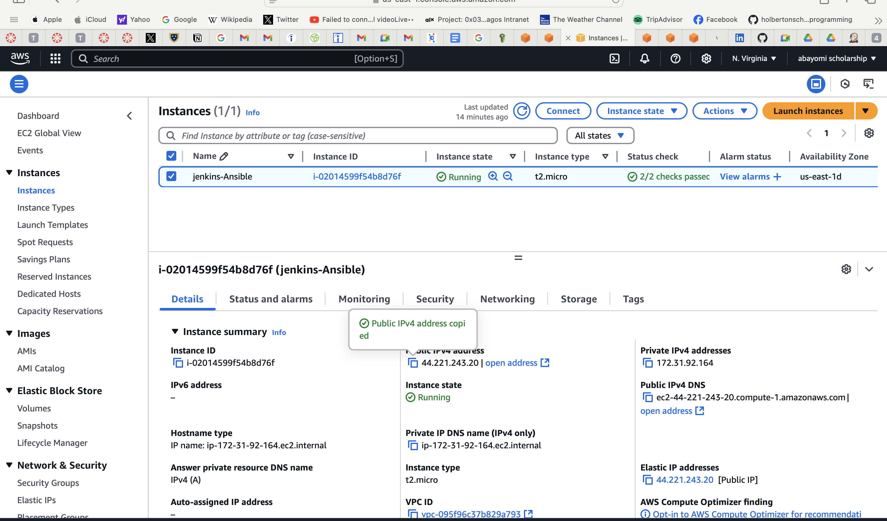
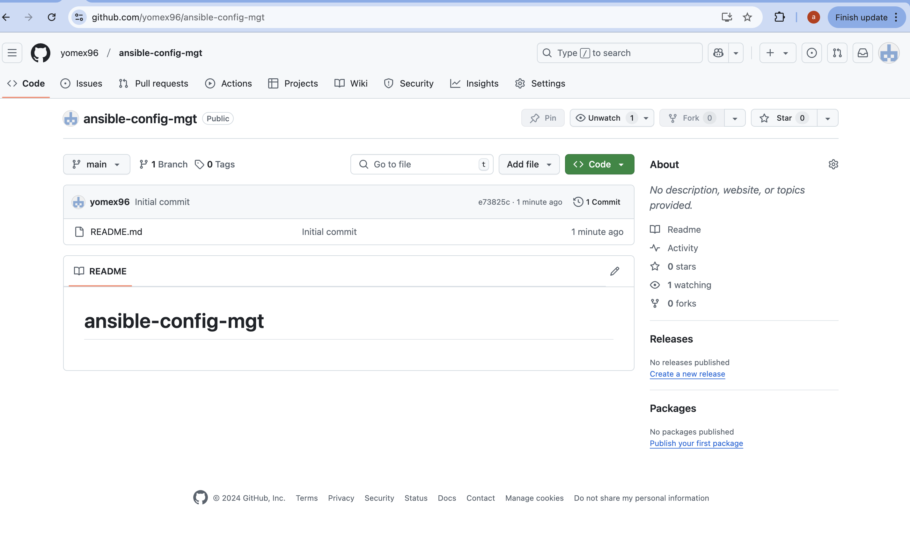
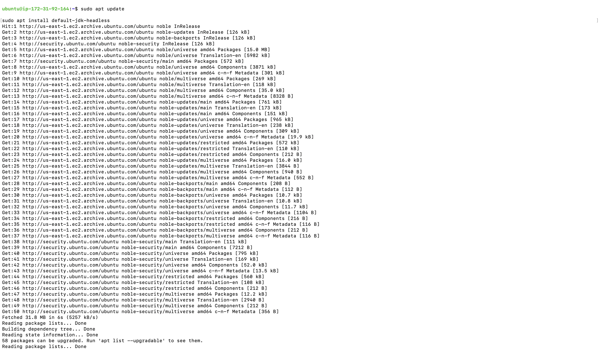
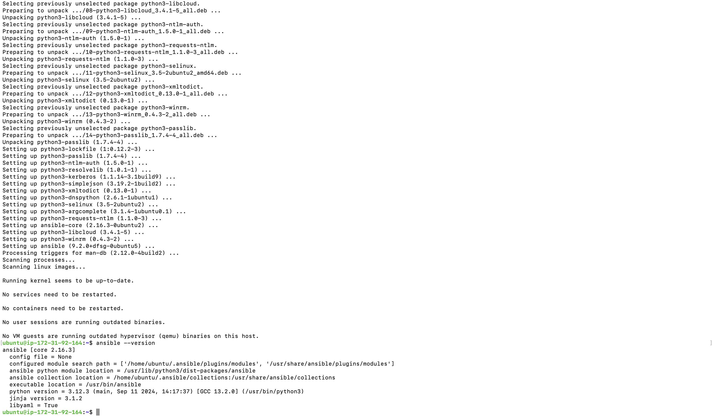
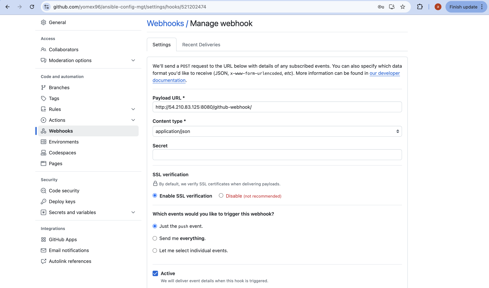
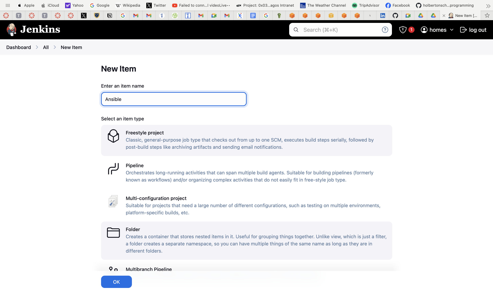

# Ansible-Configuration-Management

### Quickly before you start going through this README.md documentation, Kindly go through the Self-Study.md documentation to have a clearer scope of this project.

## Step 1 - Install and Configure Ansible on Ec2 instance

1. Update the `Name` tag on your `Jenkins` EC2 instance to `Jenkins-Ansible`. We will use this server to run playbooks.





2. In your GitHub account, create a new repository named `ansible-config-mgt`. This repository will store your Ansible configurations, playbooks, and inventory files.




3. Install Ansible on your Jenkins-Ansible ec2 instance. Update your package index:

```
sudo apt update
```


4. Install Ansible:

```
sudo apt install ansible
```


5. Verify the installation by checking the Ansible version:

```
ansible --version
```


Now that Ansible is installed, let's automate the integration between Jenkins and your GitHub repository:

6. Create a Jenkins Freestyle Project: Head over to Jenkins and create a new freestyle project called ansible.




7. Configure a webhook in GitHub and set the webhook to trigger ansible build.




8. Configure a Post-Build Action: configure a post-build action to archive all files generated during the build


9. To confirm everything is functioning as expected: Make a minor change in the README.md file in the `main` branch of your GitHub repository. Push the changes and verify that Jenkins automatically triggers the build.


10. Check that the build artifacts are saved in the specified directory.
```
ls /var/lib/jenkins/jobs/Ansible/builds/1/archive/
```


### Note: Trigger Jenkins project execution only for main (or master) branch

Now the setup would be like this image below:


Also, Every time you Stop/Start your Jenkins-Ansible server, you hsve to configure github webhook to a new IP address. In order to avoid it, It only makes sense to allocate an Elastic IP to your Jenkins-Ansible Ec2 instance.


## Step 2 - Prepare Your Development Environment Using Visual Studio Code

The development phase of DevOps requires proper coding tools, and setting up your development environment in Visual Studio Code (VSC) will streamline your process:

1. Install Visual Studio Code:
   * Download and install Visual Studio Code.

2. After you have Successfully installed VSC, confifgure it to connect to your newly created GitHub Repository:

3. Clone Your Repository:
   * Clone the ansible-config-mgt repository to your Jenkins-Ansible EC2 instance:
     ```
     git clone <ansible-config-mgt repo link>
     ```

## Step 3 - Begin Ansible Development

1. Create a New Development Branch: To manage changes effectively, create a new branch in your ansible-config-mgt repository, dedicated to developing new features or configurations.

```
git checkout -b feature/prj-11-ansible-config-mgt
```     

2. Push the Branch to GitHub: After creating the branch, push it to GitHub to keep it available for tracking and collaboration:

```
git push -u origin feature/prj-11-ansible-config-mgt
```


3. Create a directory and name it playbooks - it will be used to store all playbook files.
```
mkdir playbooks
```

4. Create a directory and name it inventory - it will be used to keep your hosts organised.
```
mkdir inventory
```


5. Within the playbooks folder, create first playbook, and name it common.yml
```
touch common.yml
```

6. Within the inventory folder, create an inventory file () for each environment (Development, Staging Testing and Production) dev, staging, uat, and prod respectively. These inventory files use .ini languages style to configure Ansible hosts.
```
touch dev.yml staging.yml uat.yml prod.yml
```


## Step 4 - Set up an Ansible Inventory.

An Ansible inventory file defines the hosts and groups of hosts upon which commands, modules, and tasks in a playbook operate. Since our intention is to execute Linux commands on remote hosts, and ensure that it is the intended configuration on a particular server that occurs. It is important to have a way to organize our hosts in such an Inventory. Save the below inventory structure in the inventory/dev file to start configuring development servers. Ensure to replace the IP addresses according to your own setup.

Note: Ansible uses TCP port 22 by default, which means it needs to ssh into target servers from Jenkins-Ansible host - for this you can implement the concept of ssh-agent. Now you need to import key into ssh-agent:
```
eval `ssh-agent -s`
ssh-add <path-to-private-key>
```

1. Confirm the key has been added with the command below, we should see the name of key.
```
ssh-add -l
```

or

```
Host jenkins-machine
  HostName <EC2_PUBLIC_IP>  # Public IP address of your EC2 instance
  User ubuntu               # Default user for Ubuntu AMI; replace if different
  IdentityFile ~/.ssh/your-key.pem  # Path to your private key file
  ForwardAgent yes         # This allows SSH forwarding of your local agent
```

2. Now, ssh into Jenkins-Ansible server using ssh-agent
```
ssh -A ubuntu@public-ip
```


3. Update your inventory/dev.yml file with this snippet of code:
```
[nfs]
<NFS-Server-Private-IP-Address> ansible_ssh_user=ec2-user

[webservers]
<Web-Server1-Private-IP-Address> ansible_ssh_user=ec2-user
<Web-Server2-Private-IP-Address> ansible_ssh_user=ec2-user

[db]
<Database-Private-IP-Address> ansible_ssh_user=ec2-user

[lb]
<Load-Balancer-Private-IP-Address> ansible_ssh_user=ubuntu

```

Each server group (nfs, webservers, db, lb) represents a different function within your infrastructure. You can refer to each group individually within playbooks to apply specific configurations.


## Step 5 - Create a Common Playbook.
1. It is time to start giving Ansible the instructions on what need to be performed on all servers listed in inventory/dev.

2. In common.yml playbook We will write configuration for repeatable, re-usable, and multi-machine tasks that is common to systems within the infrastructure.

3. Update your playbooks/common.yml file with following code

```
---
- name: update web, nfs and db servers
  hosts: webservers, nfs, db
  become: yes
  tasks:
    - name: ensure wireshark is at the latest version
      yum:
        name: wireshark
        state: latest

- name: update LB server
  hosts: lb
  become: yes
  tasks:
    - name: Update apt repo
      apt:
        update_cache: yes

    - name: ensure wireshark is at the latest version
      apt:
        name: wireshark
        state: latest
```


Examine the code above and try to make sense out of it. This playbook is divided into two parts, each of them is intended to perform the same task: install wireshark utility (or make sure it is updated to the latest version) on RHEL 9 and Ubuntu servers. It uses root user to perform this task and respective package manager: yum for RHEL 9 and apt for Ubuntu.

Feel free to update this playbook with following tasks:

* Create a directory and a file inside it.
* Change timezone on all servers.
* Run some shell script.

```
- name: Configure system settings
  hosts: all
  become: yes
  tasks:
    - name: Create directory
      file:
        path: /etc/ansible-config-mgt
        state: directory

    - name: Create file inside the directory
      file:
        path: /etc/ansible-config-mgt/config.txt
        state: touch

    - name: Change timezone to Lagos
      timezone:
        name: Africa/Lagos
```


Update the `common.yml` playbook with these new tasks.


## Step 6 - Update GIT with the latest code.

Collaboration in a DevOps environment involves using Git for version control, where changes are reviewed before merging into the main branch.

1. Check the Status of Modified Files:
```
git status

```
2. Add Files to Staging Area: Specify files to be committed, or use . to stage all changes:
```
git add playbooks/common.yml inventory/dev.ini
```

3. Commit the Changes with a Message: Include a clear and descriptive commit message:
```
git commit -m "Add common.yml playbook with initial configuration tasks"
```

4. Push your changes to the feature branch:
```
git push origin feature/prj-11-ansible-config-mgt
```


5. Create a Pull Request (PR)
* Navigate to Your Repository on GitHub and locate your branch.
* Click on Pull Request to compare changes between the feature branch and main.
* Add a Title and Description for the PR and submit it for review.


6. Review and Merge the PR
* Switch roles to review the PR. Check the code for accuracy and adherence to standards. If satisfied:
* Approve the PR and Merge it into the main branch.
* Once merged, delete the feature branch if no longer needed.


7. On your local machine, switch back to main, pull the latest changes, and confirm the merge:
   
```
git checkout main
git pull origin main
```


### After the changes are merged, Jenkins will automatically trigger a build, archiving the files in the following directory:
```
/var/lib/jenkins/jobs/ansible/builds/<build_number>/archive/
```


## Step 7 - Run the First Ansible Test
After configuring the playbook and setting up inventory files, it’s time to test if the playbook runs correctly across your servers. This step verifies if Ansible is correctly applying configurations specified in the common.yml playbook.

1. Connecting to the Instance in VS Code:
Before executing the playbook, ensure your VSCode is properly configured to connect to your Jenkins-Ansible instance over SSH. This setup simplifies command execution directly from VSCode

2. Configuring Visual Studio Code (VSCode) for SSH access to your Jenkins-Ansible instance streamlines running Ansible commands, editing files, and viewing logs directly from your local VSCode interface. Below are the steps for setting up this SSH connection.

3. Install the VSCode Remote - SSH Extension
   * Open VSCode and go to the Extensions sidebar (or press Ctrl+Shift+X).
   * Search for the extension called Remote - SSH (developed by Microsoft).
   * Click Install to add it to VSCode.


4. Configure the SSH Connection in VSCode
   * Access the Remote Explorer
   * In VSCode, go to the Remote Explorer sidebar.
   * Select SSH Targets from the dropdown.


5. Add SSH Target:
   * Click on the plus (+) icon next to SSH Targets.
   * You will be prompted to Enter SSH Connection Command. This command specifies the user and IP address of your Jenkins-Ansible instance:
  
     ```
     ssh ubuntu@<Jenkins-Ansible-Public-IP>
     ```


6. Select the SSH Configuration File:
   * After entering the command, VSCode will prompt you to select an SSH configuration file (usually ~/.ssh/config if it exists).
   * If you don’t have an SSH config file, VSCode will create one for you in your ~/.ssh/ directory.
   
7. Set Up SSH Key Authentication.
   * To authenticate using your SSH private key, follow these steps to integrate it with your ssh-agent and configure VSCode:
   *  Modify the SSH Config File:
     - Open the `~/.ssh/config` file in a text editor.
     - Add an entry for your Jenkins-Ansible instance:
       
     ```
     Host jenkins-ansible
        HostName <Jenkins-Ansible-Public-IP>
        User ubuntu
        IdentityFile <path-to-private-key>
     ```

     or
   ```
   Host jenkins-machine
  HostName <EC2_PUBLIC_IP>  # Public IP address of your EC2 instance
  User ubuntu               # Default user for Ubuntu AMI; replace if different
  IdentityFile ~/.ssh/your-key.pem  # Path to your private key file
  ForwardAgent yes         # This allows SSH forwarding of your local agent
```

     See example:
   ```
   Host 3.229.14.47
    HostName 3.229.14.47
    User ubuntu
  
    Host 3.229.14.47
      HostName 3.229.14.47
      IdentityFile C:\\Users\\HP\\Downloads\\Jenkins.pem
      User ubuntu
   ```
     
     Replace `<Jenkins-Ansible-Public-IP>` and `<path-to-private-key>` with your instance’s IP and the path to your SSH key, respectively.


### Quick Step : 

Access the instances that was created from the start of this project from the Jenkins-Ansible server to register the servers locally and allow access to the servers when trying to run the ansible playbook configuration. Follow the following steps from your GitBash.

1. Start the SSH Agent:

   ```
   eval `ssh-agent -s`
   ```

2. Add Your Private Key to SSH Agent:

   ```
   ssh-add <path-to-private-key>
   ```

3. Verify SSH Key Addition:

   ```
   ssh-add -l
   ```

4. Enable Agent Forwarding for SSH into Jenkins-Ansible Server:

   ```
   ssh -A ubuntu@<Jenkins-Ansible-Instance-Public-IP>
   ```

5. Connect to your servers locally

   ```
   ssh <Private IP address of instance>
   ```
   


### Now that the servers have been connected to locally, we can continue the following steps


8. Connect to the Jenkins-Ansible Instance:
   * In the Remote Explorer sidebar in VSCode, under SSH Targets, you should see your newly added SSH target.
   * Click on Connect next to jenkins-ansible (or the alias you created).
   * VSCode will open a new remote window connected to your Jenkins-Ansible instance, allowing you to use the terminal, edit files, and run commands directly.
   * Open the Ansible Project Directory in VSCode

9. Once connected, navigate to your Ansible project directory (ansible-config-mgt) on the Jenkins-Ansible instance:
    * In the remote VSCode window, open the File Explorer.
    * Browse to the ansible-config-mgt directory and open it.
    * You can now edit, save, and run commands directly in this directory, simplifying management and execution.

10. To confirm the SSH connection works smoothly:
    * Open the VSCode terminal (Ctrl+ or Terminal > New Terminal).
    * Run a simple command to verify access:
   
      ```
      whoami
      ```
It would display the ubuntu user or whatever username is configured for your Jenkins-Ansible instance.

11. Navigate to your project directory:
    ```
    cd ansible-config-mgt

    ```

12. Run the Playbook with Ansible:
    * To execute the common.yml playbook on the dev environment servers, use the following Ansible command. This command specifies the inventory file and playbook to use:
    ```
    ansible-playbook -i inventory/dev.yml playbooks/common.yml
    ```


13. This command does the following:
    * Uses `-i inventory/dev.yml` to specify the inventory file for the development environment.
    * Targets the `playbooks/common.yml` playbook.
    * Note: Make sure you’re in the `ansible-config-mgt` directory before running the command.
   
14. Verify Installation on Each Server:
    * After the playbook runs, verify that Wireshark was successfully installed on the servers. To confirm, SSH into each server and check the installation status by running:

      ```
      wireshark --version
      ```


If Wireshark is installed, these commands should output the path to Wireshark or display its version number.


## Updated Ansible Architecture

The updated architecture with Ansible now shows:
   * Ansible Control Node (Jenkins-Ansible Server): Hosts your Ansible configuration and executes playbooks.
   * Managed Nodes (Inventory Servers): The playbook applies tasks to these nodes (web servers, NFS, database, and load balancer servers).
   * Inventory Files: Organize managed nodes by environment (e.g., dev, staging, uat, prod), allowing targeted configurations.

Each playbook you create will ensure consistent and automated configurations across your environments, streamlining tasks like package installations, system configurations, and maintenance tasks on multiple servers.

# Key Learnings

1. Fundamentals of Ansible Configuration Management: Learned how to set up and deploy configurations across multiple servers with Ansible.

2. Inventory Management: Set up an inventory file to manage hosts in different groups (e.g., web, nfs, db servers).

3. Configuring SSH: Configured ssh access and handled key-based authentication, ensuring secure connections to remote servers.

4. Ansible Playbook Structure: Gained a strong understanding of structuring playbooks to automate common tasks, manage dependencies, and execute sequential commands.

5. Error Troubleshooting: Developed troubleshooting skills for Ansible-related SSH issues and YAML syntax errors.

## Challenges and Solutions

### Challenge: SSH Authentication Issues
Solution: Verified file paths and permissions for the SSH keys and ensured the IdentityFile path in the Ansible inventory and SSH config was accurate and correctly formatted.

### Challenge: "Permission Denied" errors on remote servers
Solution: Confirmed that the correct user (e.g., ubuntu, ec2-user) was set up on each server. This was resolved by specifying the exact username in the Ansible inventory and ensuring the keys had the correct permissions.

### Challenge: Issues with YAML Formatting in Inventory Files
Solution: Ensured proper YAML syntax, particularly around indentation and structure, which is critical in Ansible files. Simplified formatting and used tools to validate YAML files before deployment.

### Challenge: Host Key Verification Failures
Solution: Used ssh-keygen -R <host> to clear known hosts entries, added host keys permanently to avoid prompting, and used the -i option to specify the key file directly during testing.

### Challenge: Incorrect Hostnames and Inventory Parsing Warnings
Solution: Ensured correct hostnames and restructured the inventory file format from dev.ini to dev.yml, improving parsing compatibility with Ansible.

### Challenge: Parsing Errors with YAML vs. INI File Inventory
Solution: Changed the inventory file extension to .yml, adapting the syntax to be YAML-compliant, which helped Ansible correctly identify and load host configurations.

### Challenge: Permission Denied for Ansible playbooks Execution
Solution: Reviewed and corrected file permissions, ensuring that jenkins.pem had restricted permissions and was accessible to Ansible for running commands on remote servers.


## Additional Tips
1. Patience and Persistence: You see this Patience and Grit, you need to have it because each step came with new hurdles, but staying persistent helped overcome the problems, making the solution more rewarding.

2. Attention to Detail: Many issues were resolved by carefully rechecking file paths, syntax, and configurations, highlighting the importance of accuracy in configuration management.


# IMPORTANT!!!! PLEASE DO NOT FORGET TO STOP YOUR INSTANCES AFTER YOU'RE DONE WITH THE PROJECT.
