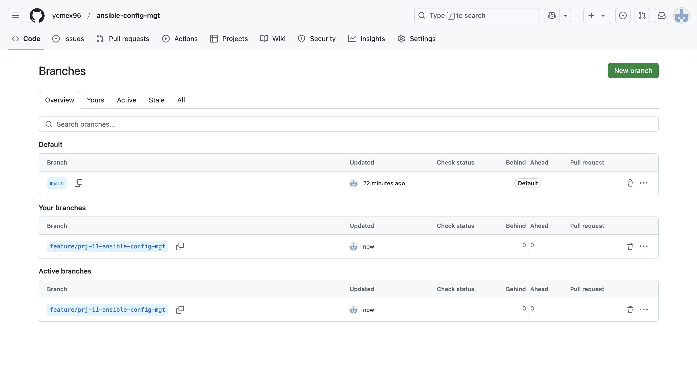
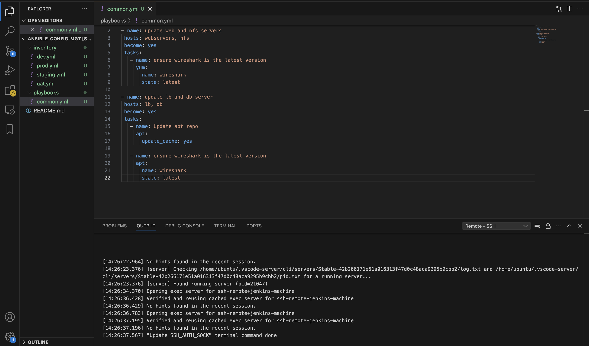

# Ansible-Configuration-Management

### Quickly before you start going through this README.md documentation, Kindly go through the Self-Study.md documentation to have a clearer scope of this project.

## Step 1 - Install and Configure Ansible on Ec2 instance

1. Update the `Name` tag on your `Jenkins` EC2 instance to `Jenkins-Ansible`. We will use this server to run playbooks.


2. In your GitHub account, create a new repository named `ansible-config-mgt`. This repository will store your Ansible configurations, playbooks, and inventory files.


3. Install Ansible on your Jenkins-Ansible ec2 instance. Update your package index:

```
sudo apt update
```


4. Install Ansible:

```
sudo apt install ansible
```


5. Verify the installation by checking the Ansible version:

```
ansible --version
```


Now that Ansible is installed, let's automate the integration between Jenkins and your GitHub repository:

6. Create a Jenkins Freestyle Project: Head over to Jenkins and create a new freestyle project called ansible.


7. Configure a webhook in GitHub and set the webhook to trigger ansible build.


8. Configure a Post-Build Action: configure a post-build action to archive all files generated during the build


9. To confirm everything is functioning as expected: Make a minor change in the README.md file in the `main` branch of your GitHub repository. Push the changes and verify that Jenkins automatically triggers the build.


10. Check that the build artifacts are saved in the specified directory.
    
```
ls /var/lib/jenkins/jobs/Ansible/builds/1/archive/
```


### Note: Trigger Jenkins project execution only for main (or master) branch

Now the setup would be like this image below:


Also, Every time you Stop/Start your Jenkins-Ansible server, you hsve to configure github webhook to a new IP address. In order to avoid it, It only makes sense to allocate an Elastic IP to your Jenkins-Ansible Ec2 instance.


## Step 2 - Prepare Your Development Environment Using Visual Studio Code

The development phase of DevOps requires proper coding tools, and setting up your development environment in Visual Studio Code (VSC) will streamline your process:

1. Install Visual Studio Code:
   * Download and install Visual Studio Code.

2. After you have Successfully installed VSC, confifgure it to connect to your newly created GitHub Repository:

3. Clone Your Repository:
   * Clone the ansible-config-mgt repository to your Jenkins-Ansible EC2 instance:
     ```
     git clone <ansible-config-mgt repo link>
     ```

## Step 3 - Begin Ansible Development

1. Create a New Development Branch: To manage changes effectively, create a new branch in your ansible-config-mgt repository, dedicated to developing new features or configurations.

```
git checkout -b feature/prj-11-ansible-config-mgt
```     


2. Push the Branch to GitHub: After creating the branch, push it to GitHub to keep it available for tracking and collaboration:

```
git push -u origin feature/prj-11-ansible-config-mgt
```





3. Create a directory and name it playbooks - it will be used to store all playbook files.
```
mkdir playbooks
```

4. Create a directory and name it inventory - it will be used to keep your hosts organised.
```
mkdir inventory
```


5. Within the playbooks folder, create first playbook, and name it common.yml
```
touch common.yml
```

6. Within the inventory folder, create an inventory file () for each environment (Development, Staging Testing and Production) dev, staging, uat, and prod respectively. These inventory files use .ini languages style to configure Ansible hosts.
```
touch dev.yml staging.yml uat.yml prod.yml
```


## Step 4 - Set up an Ansible Inventory.

An Ansible inventory file defines the hosts and groups of hosts upon which commands, modules, and tasks in a playbook operate. Since our intention is to execute Linux commands on remote hosts, and ensure that it is the intended configuration on a particular server that occurs. It is important to have a way to organize our hosts in such an Inventory. Save the below inventory structure in the inventory/dev file to start configuring development servers. Ensure to replace the IP addresses according to your own setup.

Note: Ansible uses TCP port 22 by default, which means it needs to ssh into target servers from Jenkins-Ansible host - for this you can implement the concept of ssh-agent. Now you need to import key into ssh-agent:
```
eval `ssh-agent -s`
ssh-add <path-to-private-key>
```

1. Confirm the key has been added with the command below, we should see the name of key.
```
ssh-add -l
```

or

```
Host jenkins-machine
  HostName <EC2_PUBLIC_IP>  # Public IP address of your EC2 instance
  User ubuntu               # Default user for Ubuntu AMI; replace if different
  IdentityFile ~/.ssh/your-key.pem  # Path to your private key file
  ForwardAgent yes         # This allows SSH forwarding of your local agent
```

2. Now, ssh into Jenkins-Ansible server using ssh-agent
```
ssh -A ubuntu@public-ip
```


3. Update your inventory/dev.yml file with this snippet of code:
```
[nfs]
<NFS-Server-Private-IP-Address> ansible_ssh_user=ec2-user

[webservers]
<Web-Server1-Private-IP-Address> ansible_ssh_user=ec2-user
<Web-Server2-Private-IP-Address> ansible_ssh_user=ec2-user

[db]
<Database-Private-IP-Address> ansible_ssh_user=ec2-user

[lb]
<Load-Balancer-Private-IP-Address> ansible_ssh_user=ubuntu

```


Each server group (nfs, webservers, db, lb) represents a different function within your infrastructure. You can refer to each group individually within playbooks to apply specific configurations.


## Step 5 - Create a Common Playbook.
1. It is time to start giving Ansible the instructions on what need to be performed on all servers listed in inventory/dev.

2. In common.yml playbook We will write configuration for repeatable, re-usable, and multi-machine tasks that is common to systems within the infrastructure.

3. Update your playbooks/common.yml file with following code

```
---
- name: update web, nfs and db servers
  hosts: webservers, nfs, db
  become: yes
  tasks:
    - name: ensure wireshark is at the latest version
      yum:
        name: wireshark
        state: latest

- name: update LB server
  hosts: lb
  become: yes
  tasks:
    - name: Update apt repo
      apt:
        update_cache: yes

    - name: ensure wireshark is at the latest version
      apt:
        name: wireshark
        state: latest
```



Examine the code above and try to make sense out of it. This playbook is divided into two parts, each of them is intended to perform the same task: install wireshark utility (or make sure it is updated to the latest version) on RHEL 9 and Ubuntu servers. It uses root user to perform this task and respective package manager: yum for RHEL 9 and apt for Ubuntu.

Feel free to update this playbook with following tasks:

* Create a directory and a file inside it.
* Change timezone on all servers.
* Run some shell script.

```
- name: Configure system settings
  hosts: all
  become: yes
  tasks:
    - name: Create directory
      file:
        path: /etc/ansible-config-mgt
        state: directory

    - name: Create file inside the directory
      file:
        path: /etc/ansible-config-mgt/config.txt
        state: touch

    - name: Change timezone to Lagos
      timezone:
        name: Africa/Lagos
```


Update the `common.yml` playbook with these new tasks.


## Step 6 - Update GIT with the latest code.

Collaboration in a DevOps environment involves using Git for version control, where changes are reviewed before merging into the main branch.

1. Check the Status of Modified Files:
```
git status

```
2. Add Files to Staging Area: Specify files to be committed, or use . to stage all changes:
```
git add playbooks/common.yml inventory/dev.ini
```

3. Commit the Changes with a Message: Include a clear and descriptive commit message:
```
git commit -m "Add common.yml playbook with initial configuration tasks"
```

4. Push your changes to the feature branch:
```
git push origin feature/prj-11-ansible-config-mgt
```

5. Create a Pull Request (PR)
* Navigate to Your Repository on GitHub and locate your branch.
* Click on Pull Request to compare changes between the feature branch and main.
* Add a Title and Description for the PR and submit it for review.

  
  
 

6. Review and Merge the PR
* Switch roles to review the PR. Check the code for accuracy and adherence to standards. If satisfied:
* Approve the PR and Merge it into the main branch.
* Once merged, delete the feature branch if no longer needed.

   
 


7. On your local machine, switch back to main, pull the latest changes, and confirm the merge:
   
```
git checkout main
git pull origin main
```


### After the changes are merged, Jenkins will automatically trigger a build, archiving the files in the following directory:
```
/var/lib/jenkins/jobs/ansible/builds/<build_number>/archive/
```

 


## Step 8 Run Ansible test
We will verify if the playbook works :

Change directory to ansible-config-mgt:

cd ansible-config-mgt
Run the playbook command:

```
ansible-playbook -i inventory/dev.yml playbooks/common.yml
```

 
```
wireshark --version
```

This command does the following: * Uses -i inventory/dev.yml to specify the inventory file for the development environment. * Targets the playbooks/common.yml playbook. * Note: Make sure you’re in the ansible-config-mgt directory before running the command.

## Key Learnings
Fundamentals of Ansible Configuration Management: Learned how to set up and deploy configurations across multiple servers with Ansible.

Inventory Management: Set up an inventory file to manage hosts in different groups (e.g., web, nfs, db servers).

Error Troubleshooting: Developed troubleshooting skills for Ansible-related SSH issues and YAML syntax errors

Configuring SSH: Configured ssh access and handled key-based authentication, ensuring secure connections to remote servers.

Ansible Playbook Structure: Gained a strong understanding of structuring playbooks to automate common tasks, manage dependencies, and execute sequential commands.

## Challenges and Solutions
Challenge: SSH Authentication Issues
Solution: Verified file paths and permissions for the SSH keys and ensured the IdentityFile path in the Ansible inventory and SSH config was accurate and correctly formatted.

## Challenge: "Permission Denied" errors on remote servers
Solution: Confirmed that the correct user (e.g., ubuntu, ec2-user) was set up on each server. This was resolved by specifying the exact username in the Ansible inventory and ensuring the keys had the correct permissions.

## Challenge: Issues with YAML Formatting in Inventory Files
Solution: Ensured proper YAML syntax, particularly around indentation and structure, which is critical in Ansible files. Simplified formatting and used tools to validate YAML files before deployment.

## Challenge: Host Key Verification Failures
Solution: Used ssh-keygen -R to clear known hosts entries, added host keys permanently to avoid prompting, and used the -i option to specify the key file directly during testing.

# Conclusion
We have successfully set up our infrastructure to automate configuration mangaement tasks with ansible.

   


