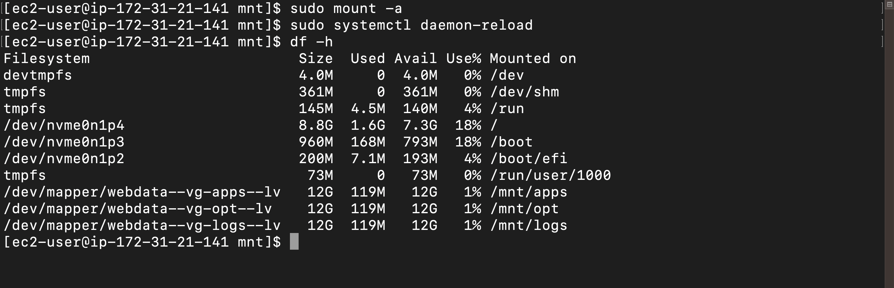
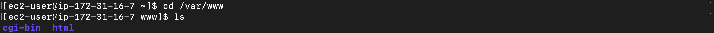

# Step 1: Prepare NFS Server
 __1.__  Create an t3. micro EC2 instance, make use of REdhat OS

__2.__  create 3 or 4 ebs volumes and attach to your instance

 __3.__ Access your instance via ssh

```bash
ssh -i <keypair.pem> ec2-user@<ipaddress>
```

 __4.__ Based on your LVM experience from Project 6, Configure LVM on the Server.
- Instead of formating the disks as ext4 you will have to format them as xfs

- Ensure there are 3 Logical Volumes. lv-opt lv-apps, and lv-logs

- Create mount points on /mnt directory for the logical volumes as follow:

Mount lv-apps on /mnt/apps – To be used by webservers Mount lv-logs on /mnt/logs – To be used by webserver logs Mount lv-opt on /mnt/opt – To be used by Jenkins server in Project 8

 __5.__ Use ``lsblk`` command to inspect what block devices are attached to the server.
 ```bash
lsblk
 ```
 

  __6.__ Use`` df -h`` command to see all mounts and free space on your server.
```bash
df -h
```


 __7.__ Use `gdisk` to create a single partition on each of the 3 disks

```bash
sudo gdisk /dev/nvme1n1
```
**NOTE:** To create a partition, follow these steps within gdisk:

- Type n to create a new partition.
- Press Enter to accept the default partition number.
- Press Enter to accept the default first sector.
- Press Enter to accept the default last sector, using the entire disk.
- Type w to write the changes and exit.
- 


```bash
sudo gdisk /dev/nvme2n1
```


```bash
sudo gdisk /dev/nvme3n1
```


```bash
sudo gdisk /dev/nvme4n1
```

 __8.__ Use `lsblk` utility to view the newly configured partition on each of the 3 disks.

```bash
lsblk
```


 __9.__   Install `lvm2` package. Lvm2 is used for managing disk drives and other storage devices

```bash
sudo yum install lvm2
```


__10.__ Use the `pvcreate` utility tool to mark each of the volumes as physical volumes to be used by LVM

```bash
sudo pvcreate /dev/nvme1n1p1
sudo pvcreate /dev/nvme2n1p1
sudo pvcreate /dev/nvme3n1p1
sudo pvcreate /dev/nvme4n1p1
```


__11.__ Verify that the physical volume has been created by running 
```bash
sudo pvs
```


__12.__ Use `vgcreate` utility to add all 3 PVs to a volume group. Name the VG `webdata-vg`
```bash
sudo vgcreate webdata-vg /dev/nvme1n1p1  /dev/nvme2n1p1  /dev/nvme3n1p1  /dev/nvme4n1p1
```


__13.__ Verify that your `VG` has been created sucessfully by running 
```bash
sudo vgs
```


__11.__ Create 3 logical volumes, name one opt-lv ,app-lv and the other logs-lv. For app-lv, use half of the disk size, then use the remaining part fpor the logs-lv
```bash
sudo lvcreate -n opt-lv -L 12G webdata-vg
sudo lvcreate -n apps-lv -L 12G webdata-vg
sudo lvcreate -n logs-lv -L 12G webdata-vg
```


__12.__ Verify that the logical volumes has been created


__13.__ Format the logical volumes using xfs
```bash
    sudo mkfs -t xfs /dev/webdata-vg/apps-lv
    sudo mkfs -t xfs /dev/webdata-vg/opt-lv
    sudo mkfs -t xfs /dev/webdata-vg/logs-lv
 ```
 

 __15.__ Create `/mnt` directory to store website files
 
```bash
sudo mkdir  /mnt/apps 
sudo mkdir  /mnt/opt
sudo mkdir  /mnt/logs
```


 __16.__ Mount `/lv-apps` on `/mnt/apps`logical volume
```bash
sudo mount /dev/webdata-vg/apps-lv /mnt/apps
sudo mount /dev/webdata-vg/opt-lv /mnt/opt
sudo mount /dev/webdata-vg/logs-lv /mnt/logs
```


 __17.__ Update `/etc/fstab` file so that the mount configuration will persist after restart of the server. The UUID of the device will be used to update the `/etc/fstab` file.

```bash
sudo blkid
```


```bash
sudo vi /etc/fstab
```
Update /etc/fstab in this format using your own UUID and remember to remove the leading and ending quotes.


__18.__ Test the configuration and reload the daemon
```bash
sudo mount -a
sudo systemctl daemon-reload
```
__19.__ Verify your setup by running `df h`, output must look like this:
```bash
df -h
```


__20.__ Install NFS server and configure it to start on reboot.

```bash
  sudo yum -y update
  sudo yum install nfs-utils -y
  sudo systemctl start nfs-server.service
  sudo systemctl enable nfs-server.service
  sudo systemctl status nfs-server.service
```


Export the mounts for webservers’ subnet cidr to connect as clients. For simplicity, you will install your all three Web Servers inside the same subnet, but in production set up you would probably want to separate each tier inside its own subnet for higher level of security. To check your subnet cidr – open your EC2 details in AWS web console and locate ‘Networking’ tab and open a Subnet link:
Make sure we set up permission that will allow our Web servers to read, write and execute files on NFS:

```bash
sudo chown -R nobody: /mnt/apps
sudo chown -R nobody: /mnt/logs
sudo chown -R nobody: /mnt/opt

sudo chmod -R 777 /mnt/apps
sudo chmod -R 777 /mnt/logs
sudo chmod -R 777 /mnt/opt

sudo systemctl restart nfs-server.service
```


__21.__ Configure access to NFS for clients within the same subnet (example of Subnet CIDR – 172.31.32.0/20 ):
```bash
sudo vi /etc/exports

/mnt/apps <Subnet-CIDR>(rw,sync,no_all_squash,no_root_squash)
/mnt/logs <Subnet-CIDR>(rw,sync,no_all_squash,no_root_squash)
/mnt/opt <Subnet-CIDR>(rw,sync,no_all_squash,no_root_squash)

Esc + :wq!

sudo exportfs -arv
```


__22.__ Check which port is used by NFS and open it using Security Groups (add new Inbound Rule)
```bash
rpcinfo -p | grep nfs
```


**Important note: In order for NFS server to be accessible from your client, you must also open following ports: TCP 111, UDP 111, UDP 2049**


### STEP TWO: CONFIGURE THE DATABASE SERVER (MYSQL)

__1.__ Launch 1 Ec2 instance on ubuntu OS

- ssh into it

__2.__ Install mysql server

```bash
sudo apt install -y mysql-server
```


-  Create a database and name it tooling

- Create a database user and name it webaccess

- Grant permission to webaccess user on tooling database to do anything only from the webservers subnet cidr
  
```bash
sudo mysql
CREATE DATABASE tooling;
CREATE USER 'webaccess'@'172.31.16.0/20' IDENTIFIED BY 'password';
GRANT ALL PRIVILEGES ON tooling.* TO 'webaccess'@'172.31.16.0/20';
FLUSH PRIVILEGES;
exit
```


- Edit the MySQL configuration file to bind it to all IP addresses, (0.0.0.0) Open the MySQL configuration file, which is located at /etc/mysql/mysql.conf.d/mysqld.cnf:

- Go to your ec2 security group in bound rules and add the port 3306 (default mysql port) and allow access from your subnet cidr

### STEP 3 -PREPARE THE WEB SERVERS

__1.__ Launch  ec2 instances (or dependending on the number of webservers you need), use Redhat OS

- ssh into it


__2.__ Install NFS client (do thid for all webservers that would be client to the NFS server)

```bash
sudo yum install nfs-utils nfs4-acl-tools -y
```


__3.__ Mount /var/www/ and target the NFS server’s export for apps.
Then test if it works.

```bash
sudo mkdir /var/www
sudo mount -t nfs -o rw,nosuid <NFS-Server-Private-IP-Address>:/mnt/apps /var/www
```


__4.__ Make sure the changes persist after reboot.

```bash
sudo vi /etc/fstab
```
- Add the following
  
```bash
<nfs-server-ipv4-address>:/mnt/apps  /var/www nfs defaults 0 0
```

__5.__  Install Remi’s repository, Apache and PHP

```bash

sudo yum install httpd -y

sudo dnf install https://dl.fedoraproject.org/pub/epel/epel-release-latest-8.noarch.rpm

sudo dnf install dnf-utils http://rpms.remirepo.net/enterprise/remi-release-8.rpm

sudo dnf module reset php

sudo dnf module enable php:remi-7.4

sudo dnf install php php-opcache php-gd php-curl php-mysqlnd

sudo systemctl start php-fpm

sudo systemctl enable php-fpm

setsebool -P httpd_execmem 1
```



**Repeat steps 1-5 for another 2 Web Servers.**

__6.__ Verify that Apache files and directories are available on the Web Server in /var/www and also on the NFS server in /mnt/apps. If you see the same files – it means NFS is mounted correctly. You can try to create a new file touch test.txt from one server and check if the same file is accessible from other Web Servers.


__7.__ Locate the log folder for Apache on the Web Server and mount it to NFS server’s export for logs. Repeat step №4 to make sure the mount point will persist after reboot.

__8.__  Fork the tooling source code from [Darey.io](https://github.com/darey-io/tooling) Github Account to your Github account.  (Learn how to fork a repo [here](https://www.youtube.com/watch?v=f5grYMXbAV0))


__9.__ Deploy the tooling website source code to the webserver

- Install git

```bash
sudo yum install git -y
```
- Now you clone the repository to the webserver

git clone https://github.com/citadelict/tooling.git

- Ensure the contents of tooling/html directory is moved to /var/www/html directory.

- Configure db credentials to connect to the mysql server in functions.php page.

- Import tooling-db.sql file into the database.
```bash
mysql -h <databse-private-ip> -u <db-username> -p <db-pasword> < tooling-db.sql
   ``` 


__10.__ Create a new admin user and password, to do this, connect to mysql remotely.
```bash
sudo mysql -u webaccess -p -h 172.31.39.146
USE DATABASE tooling;
INSERT INTO `users` (`id`, `username`, `password`, `email`, `user_type`, `status`) VALUES
(1, 'myuser', '5f4dcc3b5aa765d61d8327deb882cf99', 'user@mail.com', 'admin', '1');
 exit
```

__11.__ Now, restart apache.
```bash
sudo systemctl restart httpd.service
```
__12.__ Note: if apache doesnt restart or shows error, then you will need to allow apache to use NFS mounted directories with SElinux enabled
```bash
sudo setsebool -P httpd_use_nfs 1
```
__13.__ Allow apache to make outside connection requests.

```bash
Sudo setsebool -P httpd_can_network_connect=1
```
__14.__ Restart apache again.

__15.__ Open the website in your browser and make sure you can login into the websute with myuser user.
http://Web-Server-Public-IP-Address-or-Public-DNS-Name/index.php


Congratulations! You have just implemented a web solution for a DevOps team using LAMP stack with remote Database and NFS servers easily
