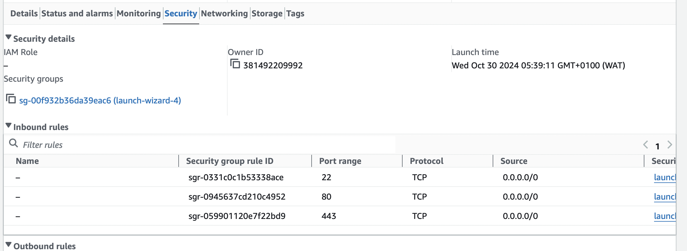
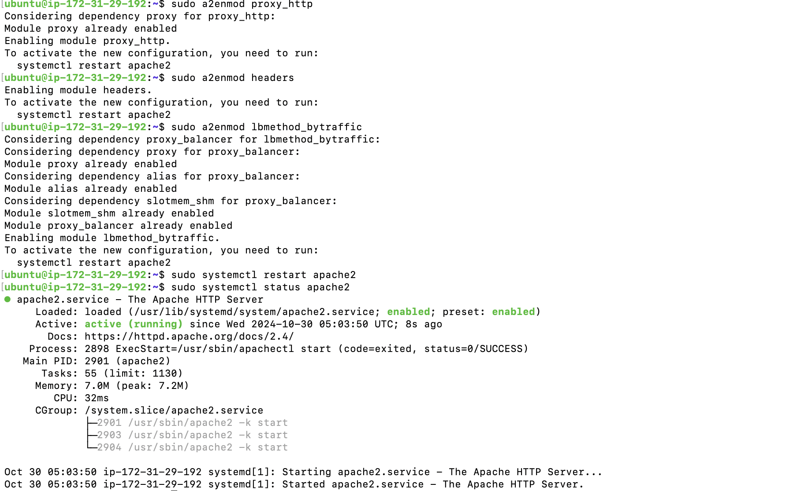
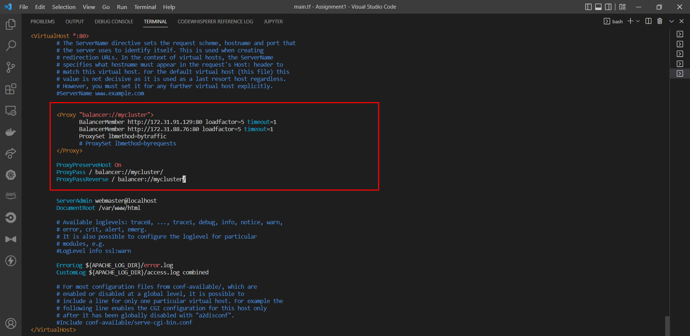
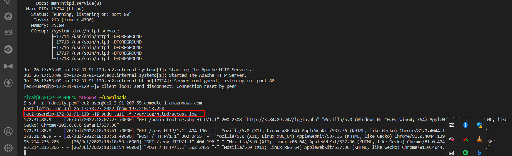
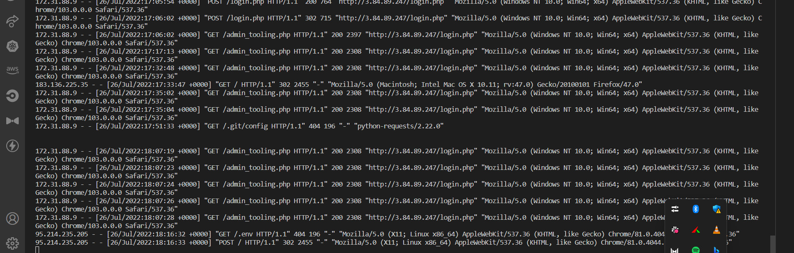
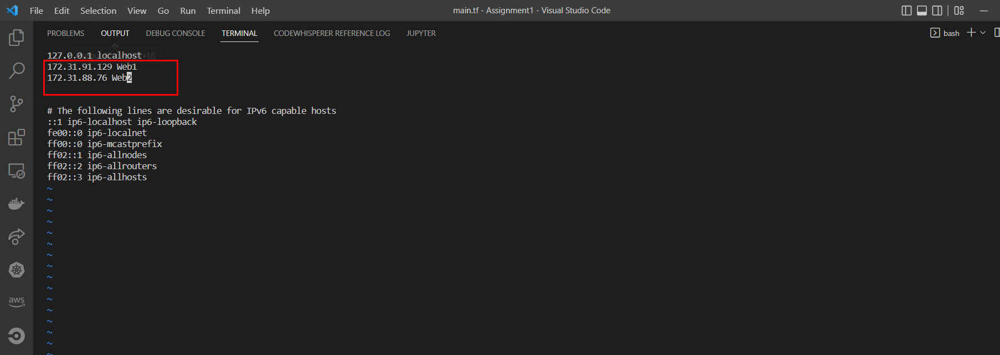
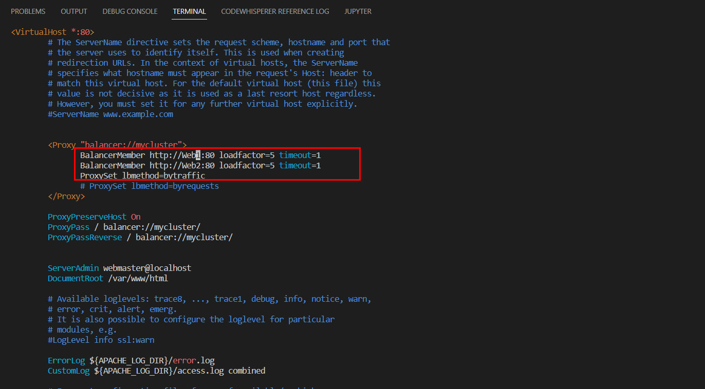

# Load-Balancing-with-Apache

## Project Overview

This project aims to deploy and configure an Apache Load Balancer to distribute traffic across two web servers hosting the Tooling Website solution.

## Prerequisites

Before proceeding with this task, ensure that you have the following components already configured:

1. Two RHEL8 Web Servers
2. One MySQL DB Server (Ubuntu 20.04)
3. One RHEL8 NFS Server


#

## Task Objectives

The main objectives of this task are:

1. Deploy an Ubuntu EC2 instance to host the Apache Load Balancer.
2. Install and configure the Apache Load Balancer on the Ubuntu EC2 instance.
3. Configure the Load Balancer to distribute traffic across the two web servers.
4. Ensure that users can access the Tooling Website solution through the Load Balancer.

# Implementation

- Create an ubuntu server which will server as loadbalancer to the webservers


It is important to open up TCP port 80 in the load balancers inbound rule as requests are made through it.



## Installing Packages

Install apache2, libxml and then configure apache for loadbalancing via enabling proxy and proxy_balancer
```
# Installing apache2
sudo apt update
sudo apt install apache2 -y
sudo apt-get install libxml2-dev
```
```
#Enable following modules:
sudo a2enmod rewrite
sudo a2enmod proxy
sudo a2enmod proxy_balancer
sudo a2enmod proxy_http
sudo a2enmod headers
sudo a2enmod lbmethod_bytraffic
```
```
#Restart apache2 service
sudo systemctl restart apache2
sudo systemctl status apache2
loadbalancer.png
```



## Configuring Load Balancer

Edit the `default.conf` file to add the backend web servers into the loadbalancers proxy for routing.
```
sudo vi /etc/apache2/sites-available/000-default.conf

```
```
#Add this configuration into this section <VirtualHost *:80>  </VirtualHost>

<Proxy "balancer://mycluster">
               BalancerMember http://<WebServer1-Private-IP-Address>:80 loadfactor=5 timeout=1
               BalancerMember http://<WebServer2-Private-IP-Address>:80 loadfactor=5 timeout=1
               ProxySet lbmethod=bytraffic
               # ProxySet lbmethod=byrequests
        </Proxy>

        ProxyPreserveHost On
        ProxyPass / balancer://mycluster/
        ProxyPassReverse / balancer://mycluster/
```
**Note:** Only 2 servers were added to the proxy list and also other ways to route traffic aside `bytraffic` includes `byrequests, bybusyness, heartbeats` which can be specified in `ProxySet lbmethod=?` .



Restart the apache2 server `sudo systemctl restart apache2`

On the web browser, test the load balancing connection using the public Ip address of our load balancer server.


To confirm that traffic is routed evenly to both web servers as the load balancer server is receiving traffic (which in our case is by refreshing the webpage) we can check the logs both servers receive 

```
sudo tail -f /var/log/httpd/access_log
```

Server1

Server2

#

## Configuring DNS Names (Locally)

In order not to always provide webserver private ip address whenever a new web server needs to be added on the list of loadbalancer proxy, we can specify them on the hosts file and provide a domain name for each which suites us

```
sudo vi /etc/hosts
```



To see this is play we can curl our dns name on the loadbalancer server. Since the DNS names are local DNS configuration we can only access them locally hence the loadbalancer uses them locally to target the backend web servers

# Load Balancing with Apache - Challenges and Solutions Summary

## Challenges and How They Were Overcome

1. **Configuring Apache as a Load Balancer**
   - **Problem:** Apache requires enabling multiple proxy and balancing modules to work effectively as a load balancer, making initial setup complex.
   - **Solution:** I installed `apache2` with required modules (`proxy`, `proxy_balancer`, `proxy_http`, and `lbmethod_bytraffic`) to enable load balancing capabilities. These modules allowed Apache to route requests based on traffic levels and other criteria.

     ```bash
     sudo apt update && sudo apt install apache2 libxml2-dev -y
     sudo a2enmod rewrite proxy proxy_balancer proxy_http headers lbmethod_bytraffic
     sudo systemctl restart apache2
     ```

2. **Editing the Apache Configuration File**
   - **Problem:** Configuring the load balancer to recognize the two backend web servers required custom entries in the Apache configuration file.
   - **Solution:** I edited the `/etc/apache2/sites-available/000-default.conf` file, adding each server as a `BalancerMember` in a `Proxy` block. This setup allowed Apache to distribute traffic evenly.

     ```apache
     <Proxy "balancer://mycluster">
         BalancerMember http://<WebServer1-Private-IP>:80 loadfactor=5 timeout=1
         BalancerMember http://<WebServer2-Private-IP>:80 loadfactor=5 timeout=1
         ProxySet lbmethod=bytraffic
     </Proxy>

     ProxyPreserveHost On
     ProxyPass / balancer://mycluster/
     ProxyPassReverse / balancer://mycluster/
     ```

3. **Ensuring Traffic Flow Through Port 80**
   - **Problem:** By default, traffic might not reach the load balancer if inbound security rules for port 80 are not set up.
   - **Solution:** I configured the security group for the EC2 instance to allow incoming traffic on port 80, ensuring the load balancer was accessible from outside networks.

4. **Testing Load Distribution**
   - **Problem:** Verifying that traffic was evenly distributed between the two web servers was challenging without a monitoring method.
   - **Solution:** I used Apache access logs on each web server (`/var/log/httpd/access_log`) to track incoming requests. By refreshing the web page multiple times and checking the logs, I confirmed the load balancer was routing traffic to both servers as expected.

5. **Implementing Local DNS for Easier Management**
   - **Problem:** Manually updating IP addresses for web servers in the load balancer configuration is cumbersome.
   - **Solution:** I configured local DNS entries on the load balancer server’s `/etc/hosts` file, assigning easy-to-remember domain names to the web servers. This allows for easy updates without modifying the main Apache configuration file.


