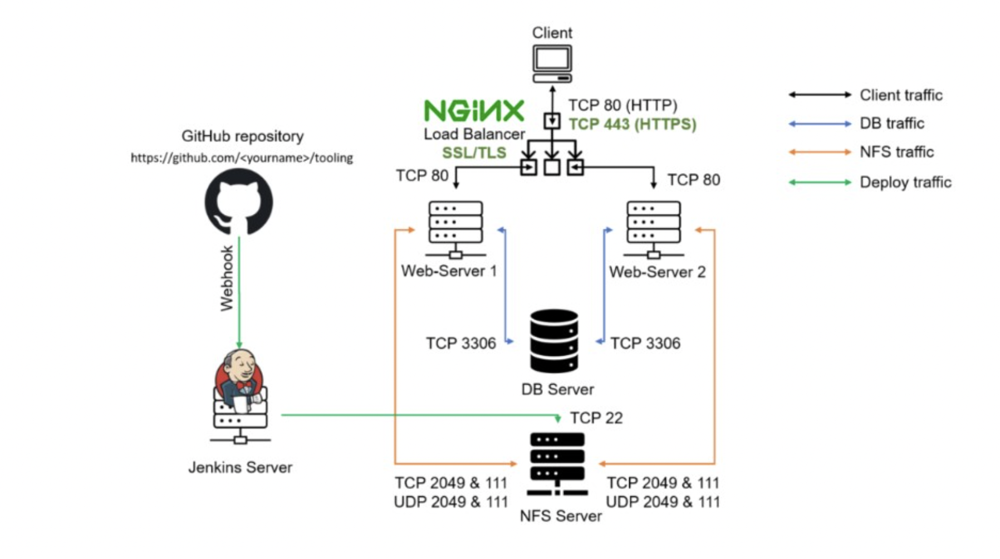
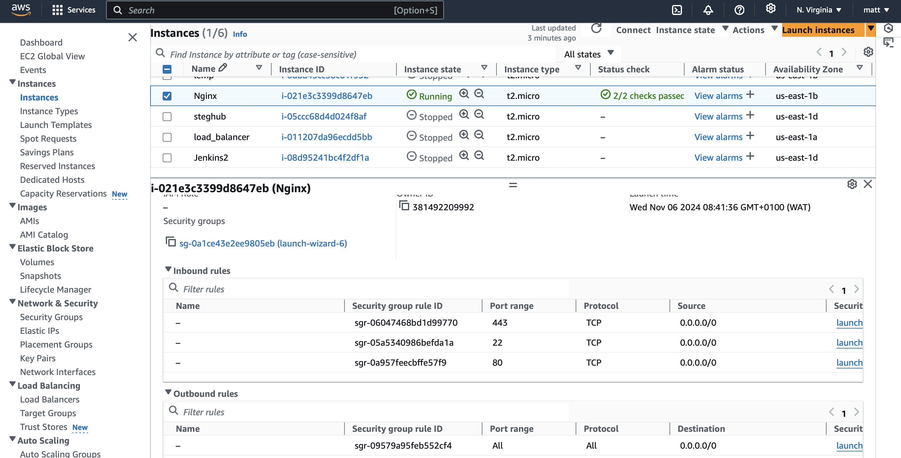
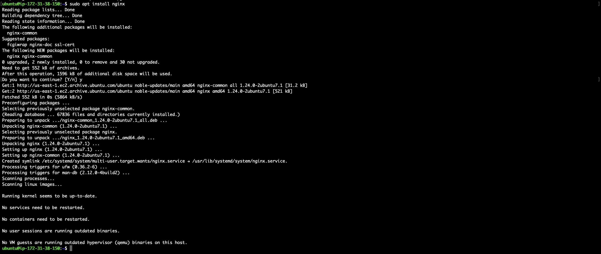
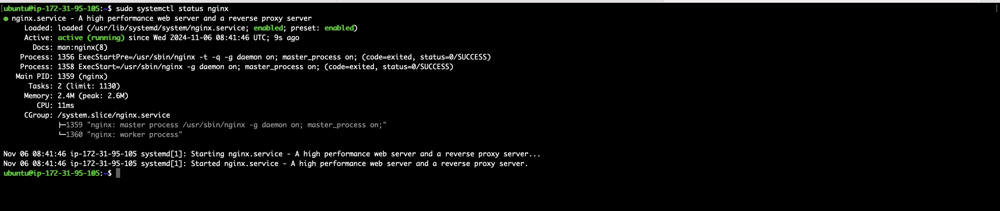
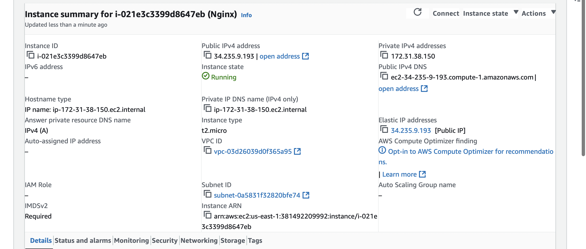
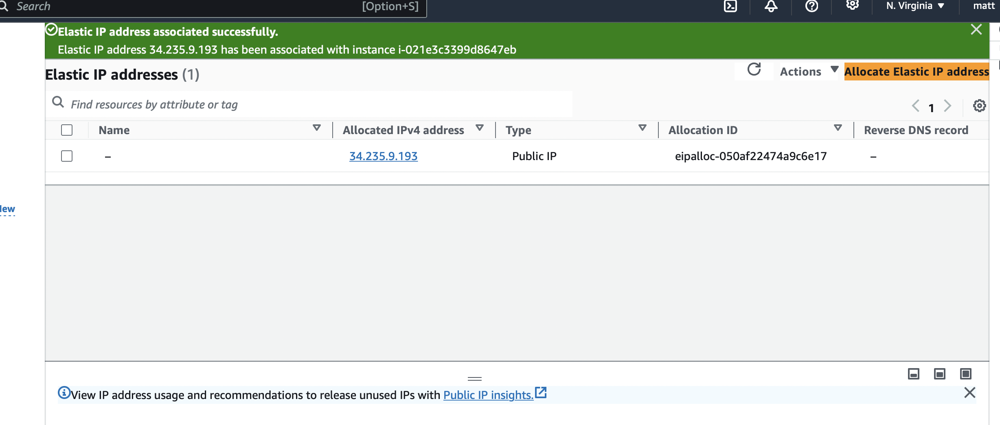
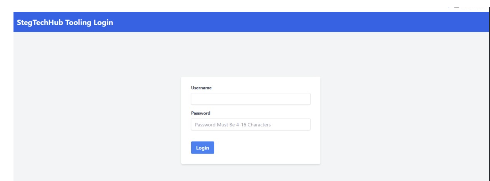
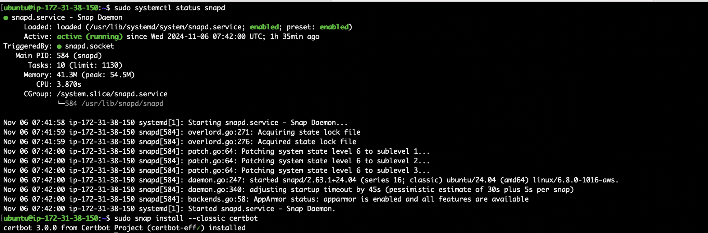
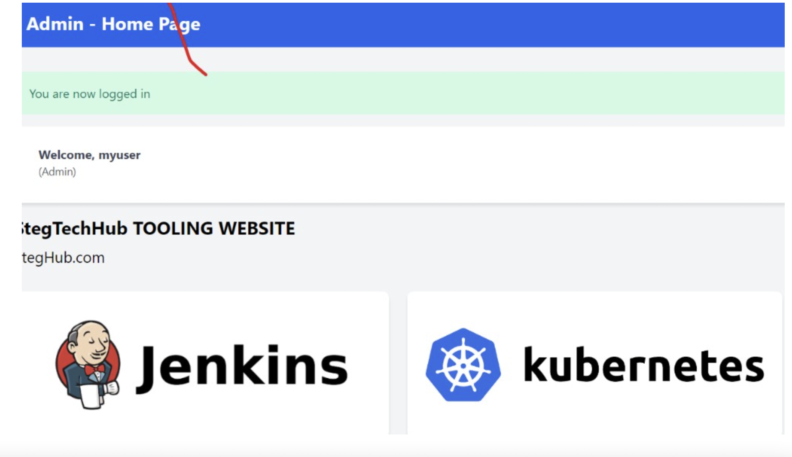

# Load-Balancer_Solution_With_Nginx

* By now we have learned what Load Balancing is used for and have configured an LB solution using Apache, but a DevOps engineer must be a versatile professional and know different alternative solutions for the same problem.That is why, in this project we will configure an Nginx Load Balancer solution.

* It is also extremely important to ensure that connections to Web solutions are secure and information is encrypted in transit - we will also cover connection over secured HTTP (HTTPS protocol), its purpose and what is required to implement it.

* When data is moving between a client (browser) and a Web Server over the Internet - it passes through multiple network devices and, if the data is not encrypted, it can be relatively easy intercepted by someone who has 
access to the intermediate equipment. This kind of information security threat is called Man-In-The-Middle (MIMT) attack.

* This threat is real - users that share sensitive information (bank details, social media access credentials, etc.) via non-secured channels, risk their data to be compromised and used by cybercriminals.

* SSL and its newer version, TSL - is a security technology that protects connection from MITM attacks by creating an encrypted session between browser and Web server. Here we will refer this family of cryptographic protocols as SSL/TLS - even though SSL was replaced by TLS, the term is still being widely used.

* SSL/TLS uses digital certificates to identify and validate a Website. A browser reads the certificate issued by a Certificate Authority (CA) to make sure that the website is registered in the CA so it can be trusted to establish a secured connection.

* There are different types of SSL/TLS certificates - we can learn more about them here. We can also watch a tutorial on how SSL works here or an additional resource hereIn this project you will register website with LetsEnrcypt Certificate Authority, to automate certificate issuance we will use a shell client recommended by LetsEncrypt - cetrbot.


## Task

This project consists of two parts:
1. Configure Nginx as a Load Balancer.
2. Register a new domain name and configure secured connection using SSL/TLS certificates.

Target architecture will look like:




## Part 1: Configure Nginx as a Load Balancer

1. Set Up Nginx on an EC2 Instance:

* Create an EC2 VM based on Ubuntu Server 20.04 LTS, and name it Nginx LB.

* Open TCP port 80 for HTTP connections.

* Open TCP port 443 for HTTPS connections.

* Update the /etc/hosts file for local DNS with the web servers' names (e.g., Web1, Web2) and their local IP addresses.



2. Install and Configure Nginx as a Load Balancer.

* Update the system and install Nginx:
```
sudo apt update
sudo apt install nginx
```





* Open the Nginx configuration file:

```
sudo vi /etc/nginx/nginx.conf
```

* Insert the following configuration into the http section:

```
upstream myproject {
    server Web1 weight=5;
    server Web2 weight=5;
}

server {
    listen 80;
    server_name www.domain.com;

    location / {
        proxy_pass http://myproject;
    }
}
```


Comment out this line: ```# include /etc/nginx/sites-enabled/*;```


3. Restart Nginx to apply the changes:

```
sudo systemctl restart nginx
sudo systemctl status nginx
```



## Part 2: Register a Domain and Configure SSL/TLS Certificates

1. Register a Domain Name using any domain registrar (e.g., GoDaddy, Bluehost).


2. Assign an Elastic IP to your Nginx server and associate your domain name with this Elastic IP.

3. Follow the guide below to allocate an Elastic IP and associate it with your EC2 instance.



4. Update the A record in your domain registrar to point to the Elastic IP of your Nginx server.

5. Update your Nginx configuration file:

```
sudo vi /etc/nginx/nginx.conf 
```

6. Change the server_name value to your new domain:

```
server_name www.<your-domain-name>.com;
```

7. Restart Nginx to apply the changes:

```
sudo systemctl restart nginx
```




## Step 3: Install Certbot and Request an SSL Certificate

1. Ensure the snapd service is active:
```
sudo systemctl status snapd
```
2. Install Certbot:
```
sudo snap install --classic certbot
```



3. Request an SSL certificate:

```
sudo ln -s /snap/bin/certbot /usr/bin/certbot
sudo certbot --nginx
```


Test secured access to your website by visiting `https://<your-domain-name>.com`.


## Step 4: Set Up SSL/TLS Certificate Renewal

1. Test the certificate renewal command:
```
sudo certbot renew --dry-run
```

2. Set up a cron job to renew the SSL certificate automatically:
```
crontab -e
```

3. Add the following line to schedule certificate renewal twice a day:

```
* */12 * * * root /usr/bin/certbot renew > /dev/null 2>&1
```

We have now successfuly configured a Nginx based Load Balancer for our webservers, ensured it can be accessed by a domain name and has SSL installed for security.

## Architecture: The setup includes:
1. Two or more backend web servers (Apache in this case)

2. One Nginx server acting as a load balancer

3. Implementation Steps:

   a. Provisioning EC2 Instances:
   * Create EC2 instances for web servers and the load balancer
   * Configure security groups to allow necessary traffic
 
   b. Installing and Configuring Web Servers:
   * Install Apache web server on the backend instances
   * Configure Apache to serve a sample web page

   c. Setting up Nginx as Load Balancer:
   * Install Nginx on the load balancer instance
   * Configure Nginx to distribute traffic to the backend servers

   d. Testing the Setup:
   * Verify that the load balancer is correctly distributing requests
   * Test failover scenarios by stopping one of the web servers

     Benefits of Nginx Load Balancer with SSL/TLS Configuration
Improved Performance and Scalability:

Nginx efficiently distributes incoming requests across multiple web servers, balancing the load. This setup allows for handling a larger number of simultaneous requests, improving the overall performance and enabling the system to scale as demand increases.
Enhanced Security:

SSL/TLS encrypts data in transit, protecting it from Man-in-the-Middle (MITM) attacks and ensuring sensitive data, like login credentials and personal information, remains secure.
Using Certbot to automate SSL certificate issuance and renewal with Let's Encrypt ensures the site remains secure without requiring manual intervention for certificate management.
Increased Reliability and High Availability:

By distributing traffic across multiple web servers, the load balancer reduces the risk of a single point of failure. If one server goes down, Nginx can automatically redirect traffic to available servers, maintaining service continuity.
Elastic IP configuration allows users to access the Nginx load balancer reliably, even if the instance changes due to scaling or maintenance.
Flexible and Customizable Traffic Management:

Nginx provides options to configure advanced load balancing algorithms and settings. You can prioritize certain servers or adjust server weights to handle high-traffic scenarios and optimize resource use.
Cost-Efficient Scaling:

You can scale horizontally by adding more web servers to handle increased demand instead of investing in a single, powerful server. This horizontal scaling is often more cost-effective for growing applications.
Challenges of Nginx Load Balancer with SSL/TLS Configuration
Complex Setup and Maintenance:

Configuring and managing an Nginx load balancer along with SSL/TLS certificates requires careful setup and an understanding of network and server management.
Ongoing maintenance, including SSL certificate renewals and ensuring the load balancer functions correctly as the server environment changes, can add complexity.
Potential Downtime During Configuration:

Improper configuration can lead to downtime if the load balancer isn’t correctly set up to route traffic, or if SSL/TLS settings cause issues with connections. Testing each part thoroughly is essential to avoid service interruptions.
Certificate Management Overhead:

While Certbot automates SSL certificate management, there may still be occasional manual troubleshooting required. Issues can arise if the domain or DNS configuration changes or if there are issues with Let's Encrypt's validation process.


# Conclusion:

This project demonstrates how to set up a load balancer using Nginx to distribute traffic across multiple web servers. It's designed to improve the performance and reliability of web applications by evenly distributing incoming requests.
