## WEB STACK IMPLEMENTATION (MEAN STACK) IN AWS

### INTRODUCTION:

### What is the MEAN stack?

The MEAN stack is a JavaScript-based framework for developing scalable web applications. The term MEAN is an acronym for MongoDB, Express, Angular, and Node — the four key technologies that make up the layers of the technology stack.

- MongoDB: A NoSQL, object-oriented database designed for use with cloud applications.
  
- Express(.js): A web application framework for Node(.js) that supports interactions between the front end (e.g., the client side) and the database.
  
- Angular(.js): Often referred to as the “front end"; a client-side JavaScript framework used to create dynamic web applications to work with interactive user interfaces.
  
- Node(.js): The premier JavaScript web server used to build scalable network applications.


### Setting up the project
For this project, we are going to implement a simple Book Register web form using MEAN stack.

# Step 0: Prerequisites

__1.__ EC2 Instance of t2.micro family type and Ubuntu 24.04 LTS (HVM) was lunched in the region of my choosing using the AWS console.
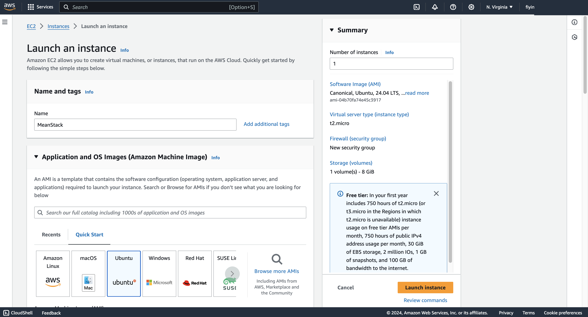


__2.__ Created SSH key pair named __mernstack__ to access the instance on port 22.

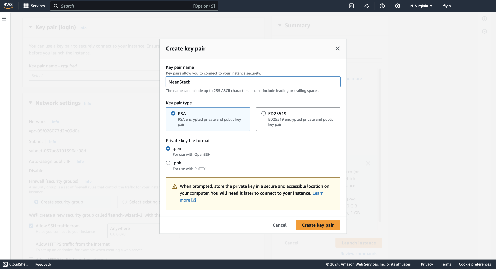


__3.__ The security group was configured with the following inbound rules:

- Allow traffic on port 80 (HTTP) with source from anywhere on the internet.
- Allow traffic on port 443 (HTTPS) with source from anywhere on the internet.
- Allow traffic on port 22 (SSH) with source from any IP address. This is opened by default.

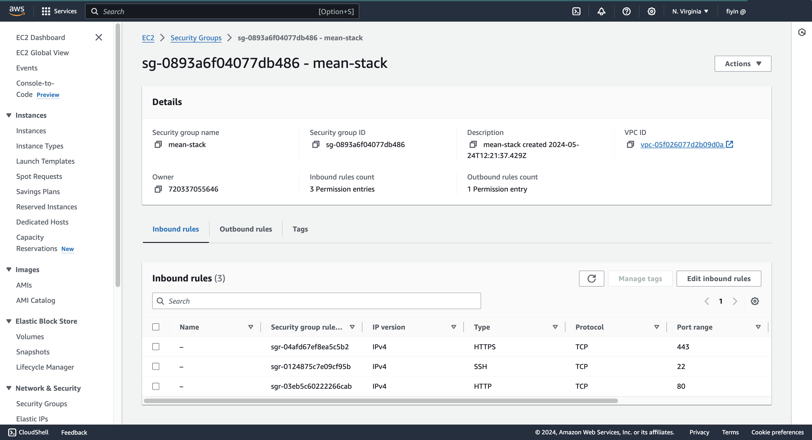

__4.__ The default VPC and Subnet was used for the networking configuration.

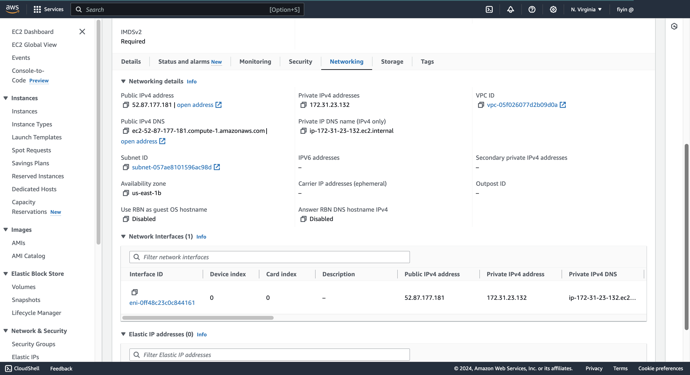

__5.__ Launched Git Bash and ran the following command:
```
ssh -i MeanStack.pem ubuntu@52.87.177.181

```
 Permission Denied.The warning about the permissions of the private key file ****(MeanStack.pem)**** indicates that its permissions are too open. SSH requires strict permissions for private key files for security reasons. 

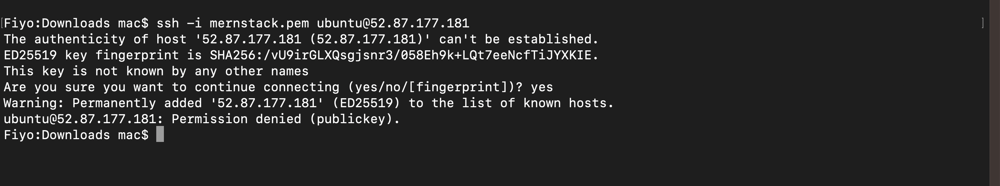

__6.__ To fix this, you need to change the permissions of the private key file. Run the following command in your terminal:

```
chmod 600 MeanStack.pem
```

__7.__ After applying these fixes, try SSH-ing into the server again.

```
ssh -i MeanStack.pem ubuntu@52.87.177.181
```
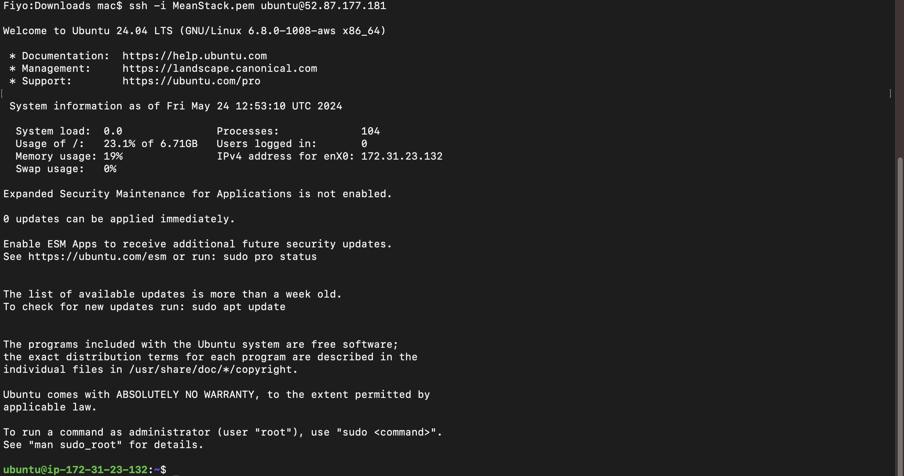

## Step 1 - BackEnd Configuration

__1.__ Install ubuntu
```
sudo apt update
```
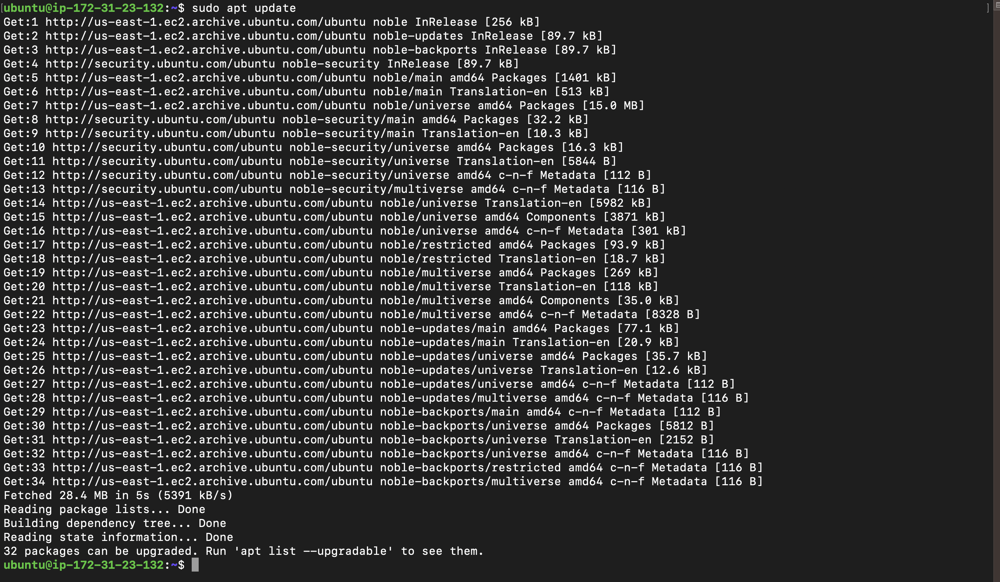

__2.__ Upgrade ubuntu
```
sudo apt upgrade
```
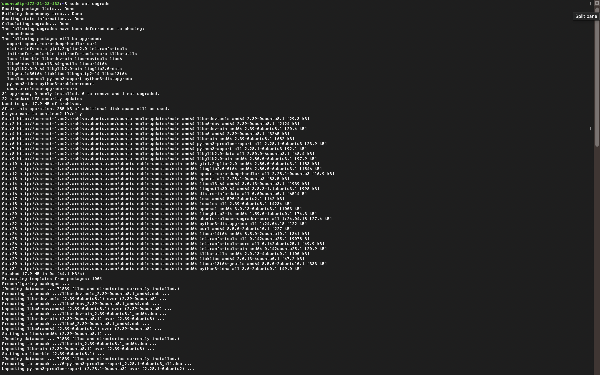


__3.__ Locate the Node.js software from [Ubuntu repositories](https://github.com/nodesource/distributions#deb).
```
curl -fsSL https://deb.nodesource.com/setup_18.x | sudo -E bash -
```


__4.__ Install Node.js on the server
```
 sudo apt-get install nodejs -y
```
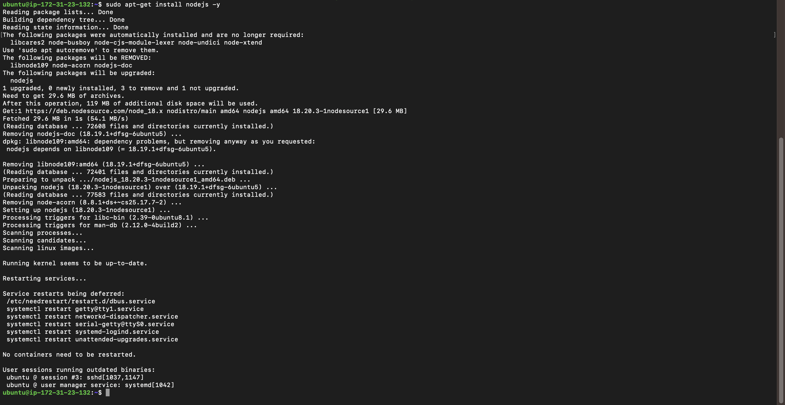

_The above command installs both nodejs and npm(node modules)_


__5.__ Verify the node installation with the command 
```
node -v
```
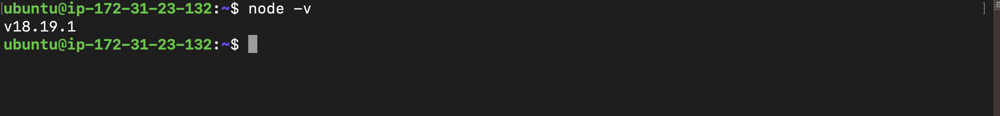

## Step 2. Install MongoDB

__1.__ Install MongoDB

- Import the public key used by the package management system
From a terminal, install gnupg and curl if they are not already available:
```bash
wget -qO - https://www.mongodb.org/static/pgp/server-6.0.asc | sudo apt-key add -
```
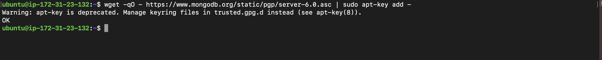

```bash
sudo apt-get install gnupg curl
```
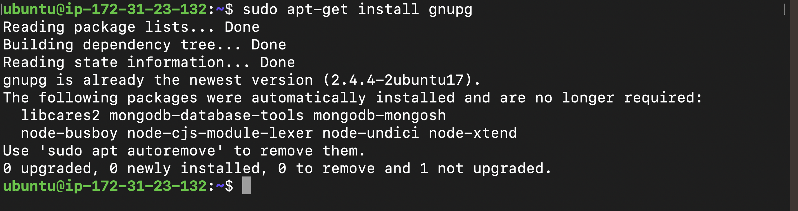

- Create a List-File

```bash
echo "deb [ arch=amd64,arm64 ] https://repo.mongodb.org/apt/ubuntu focal/mongodb-org/6.0 multiverse" | sudo tee /etc/apt/sources.list.d/mongodb-org-6.0.list
```


- Once completed, ensure to reload your system to activate the changes and add the MongoDB repository. Please note that this process may require some time to complete.
  
  ```bash
  sudo apt-get update
  ```
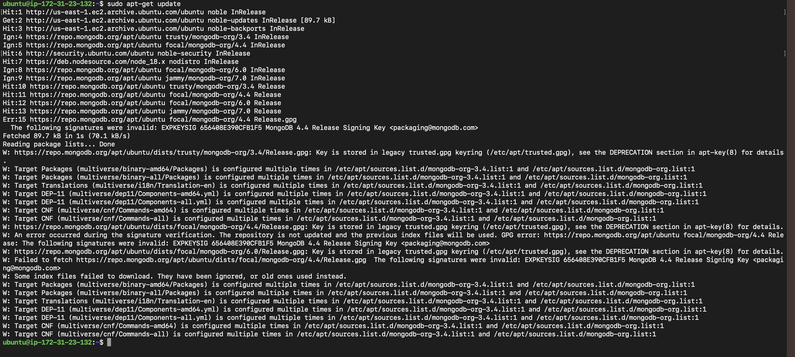

- Install the packages needed for the MongoDB version you want to run. In most cases, it is a good idea to select the current version of MongoDB. 
  
```bash
sudo apt-get install -y mongodb-org
  ```
  


- Want to install a specific version of MongoDB? 
 ```bash
  sudo apt-get update
  ```
- Reload local package database
Issue the following command to reload the local package database:
```bash
sudo apt-get install -y mongodb-org=6.0.1 mongodb-org-database=6.0.1 mongodb-org-server=6.0.1 mongodb-mongosh=6.0.1 mongodb-org-mongos=6.0.1 mongodb-org-tools=6.0.1
```
- Verify if the database is sucessful

```bash
sudo systemctl start mongod
sudo systemctl status mongod
```


__2.__  Install node package

```bash 
sudo apt install -y npm 
```
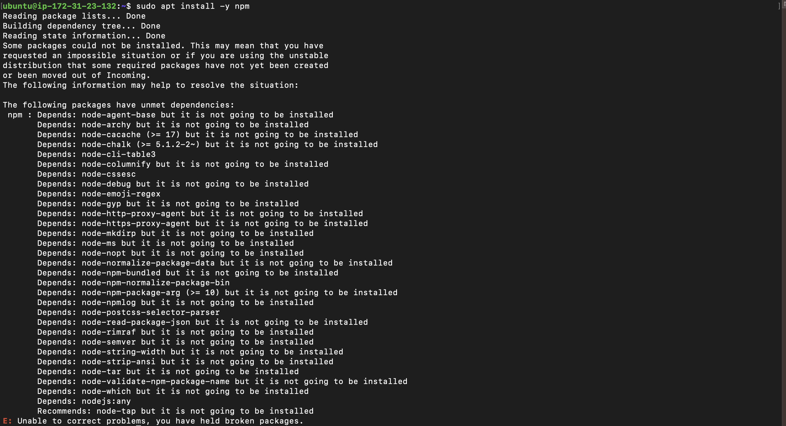

__3.__ Install body-parser package

```bash 
sudo npm install body-parser
```
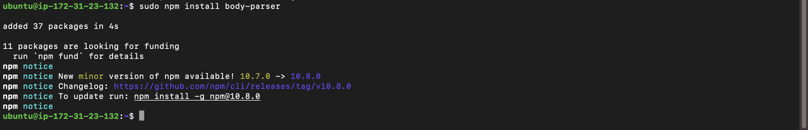

__4.__ Create a folder named `Books`

```bash 
$ mkdir Books && cd Books
```
__5.__  In the `Books` directory, initialize npm project

```bash
npm init
```
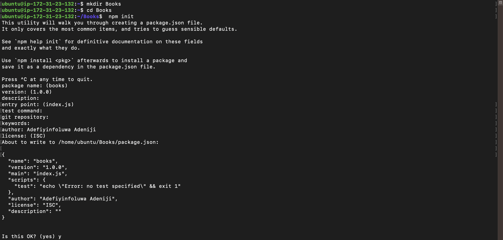

__6.__ Add a file to it named server.js

```bash
vi server.js
```
Copy and paste

```bash
var express = require('express');
var bodyParser = require('body-parser');
var app = express();
app.use(express.static(__dirname + '/public'));
app.use(bodyParser.json());
require('./apps/routes')(app);
app.set('port', 3000);
app.listen(app.get('port'), function(){
    console.log('Server up: http://localhost:' + app.get('port'));
});
```
## Step 3. Install Express and set up routes to the server

__1.__ Install Express & Mongoose
```bash
sudo npm install express 
sudo apt install mongoose
```
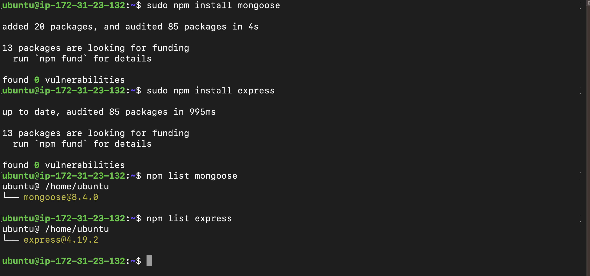

__2.__ In `Books` directory create a folder named *apps*

```bash
$ mkdir apps && cd apps
```
__3.__ Create a `routes.js` file inside apps directory
```bash
vi routes.js
```

then paste this code inside

```bash 
    var Book = require('./models/book');
module.exports = function(app){
    app.get('/book', function(req,res){
        Book.find({}, function(err, result){
            if(err) throw err;
            res.json(result);
        });
    });
    app.post('/book', function(req, res){
        var book = new Book({
            name:req.body.name,
            isbn:req.body.isbn,
            author:req.body.author,
            pages:req.body.pages
        });
        book.save(function(err, result){
            if(err)throw err;
            res.json({
                message:"Successfully added book",
                book:result
            });
        });
    });
    app.delete("/book/:isbn", function(req, res){
        Book.findOneAndRemove(req.query, function(err,result){
            if(err) throw err;
            res.json({
                message: "Successfully deleted the book",
                book: result
            });
        });
    });
    var path = require('path');
    app.get('*', function(req,res){
        res.sendfile(path.json(__dirname + '/public', 'index.html'));
    });
};
```

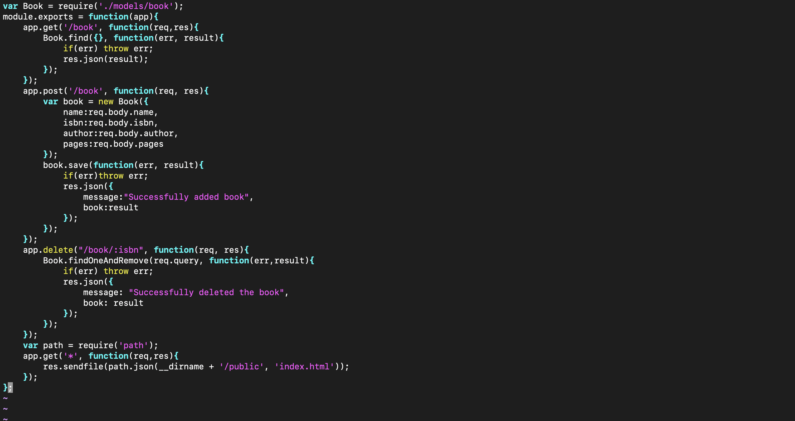

__4.__ In the  `models` folder, createa folder named  `models` 

```bash
mkdir models && cd models
```

__5.__  Create a `book.js` file inside `models` directory 
   
```bash
vi book.js
```
Copy this code inside
```bash
var mongoose = require('mongoose');
var dbHost = 'mongodb://localhost:27017/test';
mongoose.connect(dbHost);
mongoose.connection;
mongoose.set('debug', true);
var bookSchema = mongoose.Schema({
    name: String,
    isbn: {type: String, index: true},
    author: String,
    pages: Number
});
var Book = mongoose.model('Book', bookSchema);
module.exports = mongoose.model('Book', bookSchema);

```
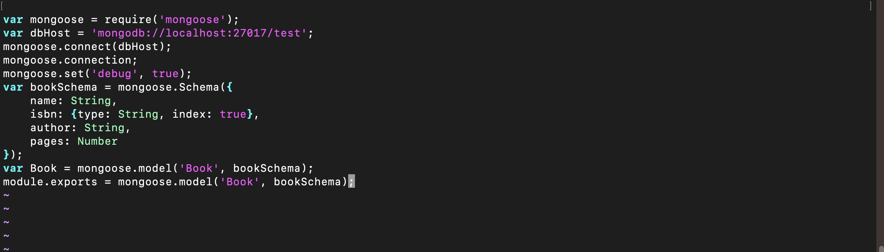

## Step 3 - Access the routes with AngularJs

__1.__  Change the directory back to `books`

```bash
cd ../.. 
```
__2.__  Create a folder named `public` 
```
mkdir public && cd public
```
__3.__ Add a file named  `script.js` 

```bash
vi script.js
```
Copy this code and paste inside

```bash
var app = angular.module('myApp', []);
app.controller('myCtrl', function($scope, $http) {
    // Fetch books from the server
    $http({
        method: 'GET',
        url: '/book'
    }).then(function successCallback(response) {
        $scope.books = response.data;
    }, function errorCallback(response) {
        console.log('Error:' + response);
    });

    // Delete a book
    $scope.del_book = function(book) {
        $http({
            method: 'DELETE',
            url: '/book/' + book.isbn // Use book.isbn directly in the URL
        }).then(function successCallback(response) {
            console.log(response);
            // Optionally, refresh the book list or remove the deleted book from $scope.books
        }, function errorCallback(response) {
            console.log('Error:' + response);
        });
    };

    // Add a new book
    $scope.add_book = function() {
        var body = {
            name: $scope.Name,
            isbn: $scope.Isbn,
            author: $scope.Author,
            pages: $scope.Pages
        };

        $http({
            method: 'POST', // Changed to POST for adding a book
            url: '/book',
            data: body,
            headers: {
                'Content-Type': 'application/json' // Set the content type to JSON
            }
        }).then(function successCallback(response) {
            console.log(response);
            // Optionally, refresh the book list or add the new book to $scope.books
        }, function errorCallback(response) {
            console.log('Error:' + response);
        });
    };
});
```
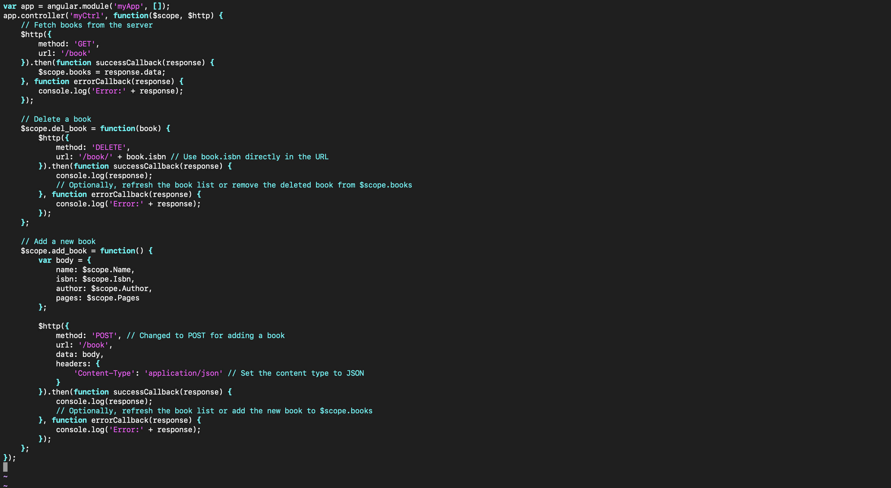

__3.__ In the `public` folder, create a file named   `index.html` 

```bash
vi index.html
```
then copy and past the code inside
```bash
<!doctype html>
<html ng-app="myApp" ng-controller="myCtrl">
<head>
    <script src="https://ajax.googleapis.com/ajax/libs/angularjs/1.6.4/angular.min.js"></script>
    <script src="script.js"></script>
</head>    
    <body>
        <div>
            <table>
                <tr>
                    <td>Name:</td>
                    <td><input type="text" ng-model="Name"></td>
                </tr>
                <tr>
                    <td>Isbn:</td>
                    <td><input type="text" ng-model="Isbn"></td>
                </tr>
                <tr>
                    <td>Author:</td>
                    <td><input type="text" ng-model="Author"></td>
                </tr>
                <tr>
                    <td>Pages:</td>
                    <td><input type="text" ng-model="Pages"></td>
                </tr>
            </table>
            <button ng-click="add_book()">Add</button>
        </div>
        <hr>
        <div>
            <table>
                <tr>
                    <th>Name</th>
                    <th>Isbn</th>
                    <th>Author</th>
                    <th>Pages</th>
                </tr>

                <tr ng-repeat="book in books">
                    <td>{{book.name}}</td>
                    <td>{{book.isbn}}</td>
                    <td>{{book.author}}</td>
                    <td>{{book.pages}}</td>

                    <td><input type="button" value="Delete" data-ng-click="del_book(book)"></td>
                </tr>
            </table>
        </div>
    </body>
</html>
```
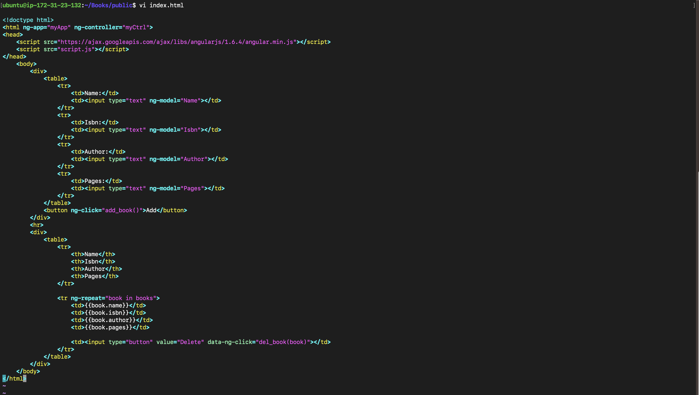

__4.__  Change the directory back to `Books`

```bash
cd ..
```
__5.__ Start the server by running this command

```bash
node server.js
```


__6.__ Access the Book Register web application from the internet with a browser using:

```bash
http://server-public-ip:3000
```
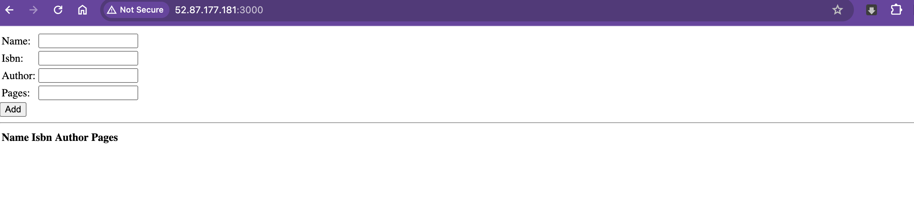
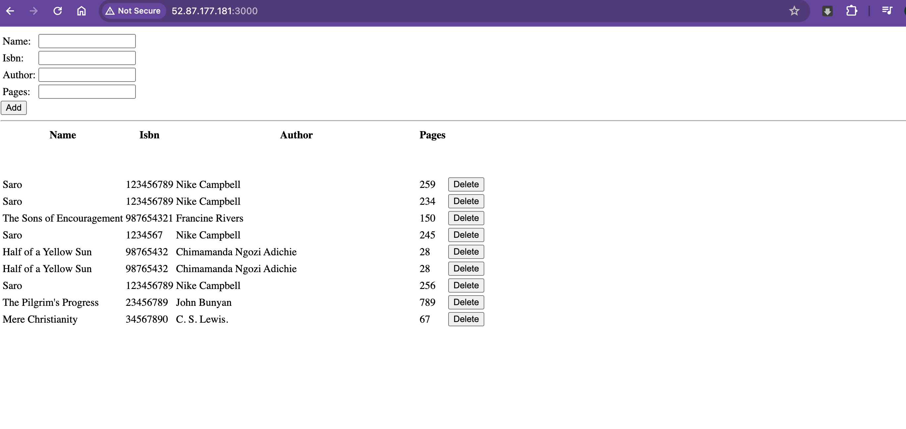


## Conclusion
Congratulations! We've accomplished the setup and deployment of a basic Book Registration web form using the MEAN stack. This application empowers you to effortlessly add, view, and remove books from a MongoDB database via a user-friendly web interface built with AngularJS.
