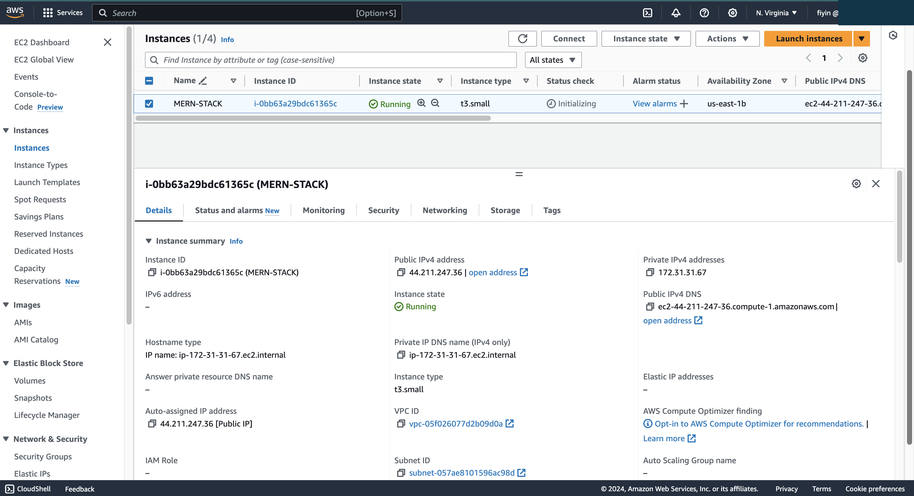
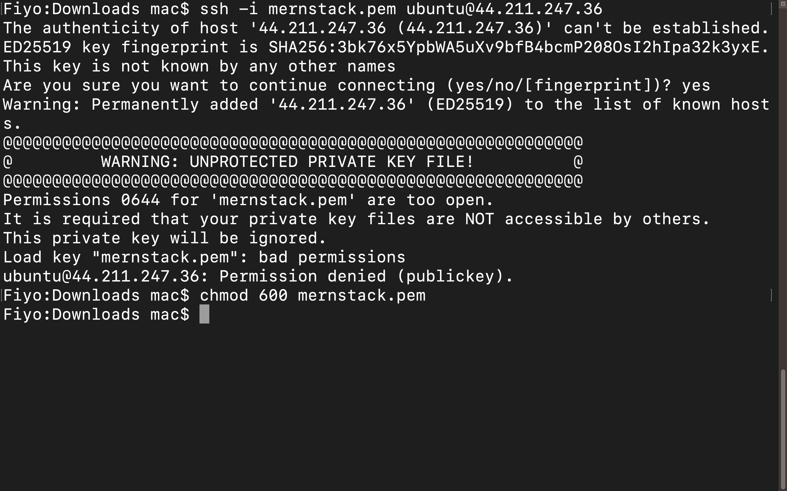
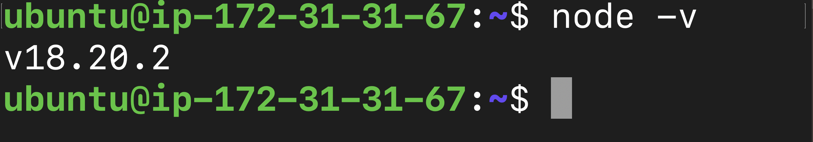

Sure! Here's the updated `documentation.md` with the new image paths:

---

# WEB STACK IMPLEMENTATION (MERN STACK) IN AWS

### INTRODUCTION:

### What is the MERN stack?
The 
***MERN stack*** 
is a web development framework made up of the stack of MongoDB, Express, React.js, and Node.js. It is one of the several variants of the 
MEAN stack.

***MERN*** Stands For:

- M- MongoDB
- E- ExpressJS
- R-ReactJS
- N-Node.js

When you use the MERN stack, you work with React to implement the presentation layer, 
Express and Node.js to make up the middle or application layer, and MongoDB to create the database layer.

In this MERN stack tutorial, we will utilize these four technologies to develop a basic **To-Do application** that is able to create a to-do list.

### Setting up the project

MERN lets us create full-stack solutions. So, to leverage its full potential, we will be creating a MERN stack project. For this project, we will create both a back end and a front end. The front end will be implemented with React and the back end will be implemented with MongoDB, Node.js, and Express. We will call the front end client and the back end server.

## Step 0: Prerequisites

__1.__ EC2 Instance of t3.small type and Ubuntu 24.04 LTS (HVM) was launched in the region of my choosing using the AWS console.




__2.__ Created SSH key pair named __mernstack__ to access the instance on port 22.


__3.__ The security group was configured with the following inbound rules:

- Allow traffic on port 80 (HTTP) with source from anywhere on the internet.
- Allow traffic on port 443 (HTTPS) with source from anywhere on the internet.
- Allow traffic on port 22 (SSH) with source from any IP address. This is opened by default.


__4.__ The default VPC and Subnet were used for the networking configuration.


__5.__ Launched Git Bash and ran the following command:
```
ssh -i mernstack.pem ubuntu@44.211.247.36

```
__6.__ Permission Denied. The warning about the permissions of the private key file ****(Lemp-Server.pem)**** indicates that its permissions are too open. SSH requires strict permissions for private key files for security reasons.


_7.__ To fix this, you need to change the permissions of the private key file. Run the following command in your terminal:

```
chmod 600 mernstack.pem
```


__8.__ After applying these fixes, try SSH-ing into the server again.

```
ssh -i mernstack.pem ubuntu@44.211.247.36
```


## Step 1 - BackEnd Configuration
__1.__ __Update ubuntu__
```
sudo apt update
```


__2.__ __Upgrade ubuntu__
```
sudo apt upgrade
```


__3.__ __Location of Node.js__
```
curl -fsSL https://deb.nodesource.com/setup_18.x | sudo -E bash -
```


__4.__ Install Node.js on the server
```
sudo apt-get install -y nodejs
```


__5.__ Verify the node installation with the command 
```
node -v
or 
npm -v
```


### Application Code Setup

__6.__ Create a new directory for your To-Do project
```
$ mkdir Todo
```


__7.__ Verify the **Todo** directory is created with ***ls*** command
```
$ ls
```

**Tip**: In order to see some more useful information about files and directories, you can use the combination of keys *ls-lih-*. It will show you different properties and size in a human-readable format. You can learn more about different useful keys for the ls command with *ls--help*

__8.__ Change your current directory to the newly created one
```
$ cd Todo
```


__9.__ Initialise the project 

```
npm init
```
___NB: A new file package.json will be created. Follow the prompts after running the command___


## Step 2: Install ExpressJS

__1.__ To use express, install it using npm
```
$ npm install express
```


__2.__ Create a file ***index.js*** with the command below
```
 $ touch index.js
```


__3.__ Run `ls` to confirm that your index.js file is successfully created


__4.__ Install the dotenv module
```
$ npm install dotenv
```


__5.__ Open the index.js file with the command below
```
$ vim index.js
```
Type the code below into it and save.
```
const express = require('express');
require('dotenv').config();

const app = express();

const port = process.env.PORT || 5000;

app.use((req, res, next) => {
  res.header("Access-Control-Allow-Origin", "*");
  res.header("Access-Control-Allow-Headers", "Origin, X-Requested-With, Content-Type, Accept");
  next();
});

app.use((req, res, next) => {
  res.send('Welcome to Express');
});

app.listen(port, () => {
  console.log(`Server running on port ${port}`);
});
```
__NB: use `:w` to save in vim and use `:qa` to exit_


__5.__  Start the server to see if it works. 

```
$ node index.js
```

If everything goes well, you should see `server running on port 5000` in your terminal.

_NB: Ensure you have opened the port `5000` in your security group_


__6.__ Open up your browser and try to access your server's Public IP followed by port `5000`

```
http://34.205.144.109:5000
```


